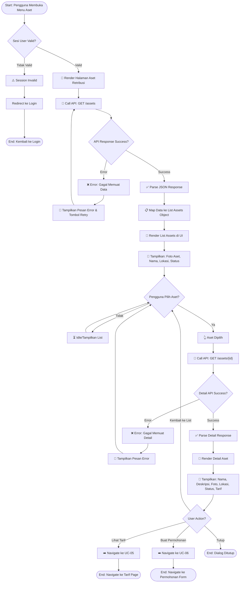
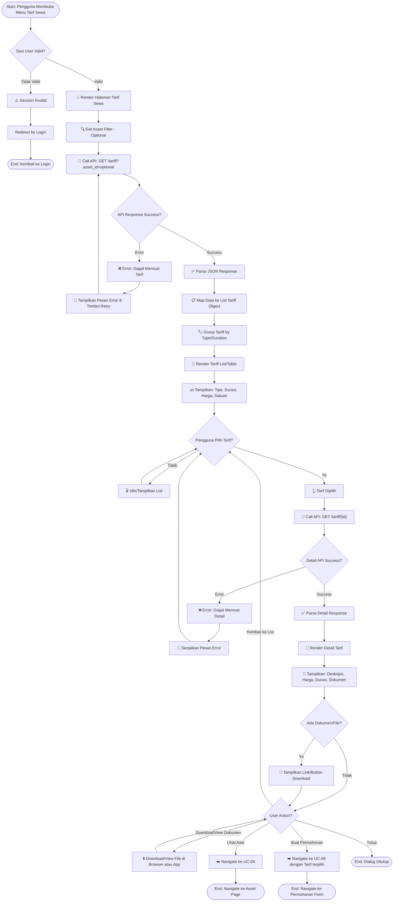
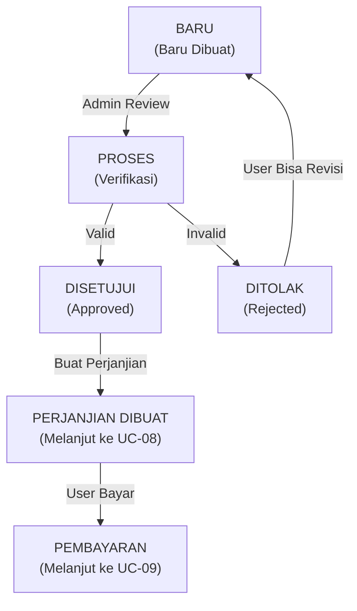
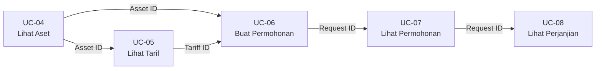

```mermaid
flowchart TD
    Start([Start: Pengguna Membuka Menu Permohonan]) --> CheckSession{Sesi User Valid?}
    
    CheckSession -->|Tidak Valid| ErrorSession["⚠️ Session Invalid"]
    ErrorSession --> Redirect1["Redirect ke Login"]
    Redirect1 --> End1(["End: Kembali ke Login"])
    
    CheckSession -->|Valid| LoadUI["📱 Render Halaman Daftar Permohonan"]
    LoadUI --> InitFilter["🔍 Initialize Filter/Sort Options"]
    InitFilter --> CallAPI["🔗 Call API: GET /requests"]
    
    CallAPI --> APIResponse{API Response Success?}
    
    APIResponse -->|Error| ErrorAPI["❌ Error: Gagal Memuat Permohonan"]
    ErrorAPI --> ShowError["📢 Tampilkan Pesan Error & Tombol Retry"]
    ShowError --> CallAPI
    
    APIResponse -->|Success| ParseData["✅ Parse JSON Response"]
    ParseData --> MapRequests["📋 Map Data ke List Request Object"]
    MapRequests --> CheckData{Data Kosong?}
    
    CheckData -->|Ya| EmptyState["📭 Tampilkan Empty State: 'Belum ada permohonan'"]
    EmptyState --> UserAction1{User Action?}
    UserAction1 -->|Buat Permohonan| GoCreate["➡️ Navigate ke UC-06"]
    UserAction1 -->|Refresh| CallAPI
    
    CheckData -->|Tidak| SortData["📊 Sort/Filter data berdasarkan pilihan user"]
    SortData --> RenderList["🎨 Render Request List dengan Status Badge"]
    
    RenderList --> DisplayRequests["📋 Tampilkan: No. Request, Aset, Tanggal Buat, Status"]
    DisplayRequests --> DisplayStatus["🏷️ Tampilkan Status Badge (BARU/PROSES/DISETUJUI/DITOLAK)"]
    DisplayStatus --> UserSelect{Pengguna Pilih Permohonan?}
    
    UserSelect -->|Tidak| Idle1["⏳ Idle/Tampilkan List"]
    Idle1 --> UserSelect
    
    UserSelect -->|Ya| SelectRequest["👆 Permohonan Dipilih"]
    SelectRequest --> CallDetailAPI["🔗 Call API: GET /requests/{id}"]
    
    CallDetailAPI --> DetailResponse{Detail API Success?}
    
    DetailResponse -->|Error| ErrorDetail["❌ Error: Gagal Memuat Detail"]
    ErrorDetail --> ShowDetailError["📢 Tampilkan Pesan Error"]
    ShowDetailError --> UserSelect
    
    DetailResponse -->|Success| ParseDetail["✅ Parse Detail Response"]
    ParseDetail --> RenderDetail["🎨 Render Detail Permohonan"]
    RenderDetail --> DisplayDetail["📄 Tampilkan: Nomor, Aset, Durasi, Status, Dokumen"]
    DisplayDetail --> CheckStatus{Status Permohonan?}
    
    CheckStatus -->|BARU| ShowNewStatus["🔵 Status BARU - Menunggu Review"]
    CheckStatus -->|PROSES| ShowProcessStatus["🟡 Status PROSES - Sedang Diverifikasi"]
    CheckStatus -->|DISETUJUI| ShowApproveStatus["🟢 Status DISETUJUI - Lihat Perjanjian"]
    CheckStatus -->|DITOLAK| ShowRejectStatus["🔴 Status DITOLAK - Alasan Penolakan"]
    
    ShowNewStatus --> UserAction2{User Action?}
    ShowProcessStatus --> UserAction2
    ShowApproveStatus --> UserAction2
    ShowRejectStatus --> UserAction2
    
    UserAction2 -->|Lihat Dokumen| ViewDoc["📎 Display Documents/Attachment"]
    ViewDoc --> DownloadDoc["⬇️ Download/View File"]
    DownloadDoc --> UserAction2
    
    UserAction2 -->|Lihat Perjanjian| GoPerjanjian["➡️ Navigate ke UC-08"]
    UserAction2 -->|Edit/Buat Ulang| GoEdit["➡️ Navigate ke UC-06 untuk Edit"]
    UserAction2 -->|Hapus| ConfirmDelete{Confirm Delete?}
    ConfirmDelete -->|Ya| DeleteRequest["🗑️ Call API DELETE"]
    DeleteRequest --> BackToList["Kembali ke List"]
    ConfirmDelete -->|Tidak| UserAction2
    BackToList --> UserSelect
    
    UserAction2 -->|Kembali ke List| UserSelect
    UserAction2 -->|Tutup| Close1(["End: Dialog Ditutup"])
    
    GoPerjanjian --> End2(["End: Navigate ke Perjanjian Page"])
    GoEdit --> End3(["End: Navigate ke Permohonan Form"])
    GoCreate --> End4(["End: Navigate ke Create Permohonan"])
```

# BPMN Diagrams — TAPATUPA

> Business Process Model and Notation (BPMN) untuk tiga use case utama di aplikasi TAPATUPA

---

## 📑 Daftar Isi

1. [UC-04: Lihat Aset Retribusi](#uc-04--lihat-aset-retribusi)
2. [UC-05: Lihat Tarif Sewa](#uc-05--lihat-tarif-sewa)
3. [UC-07: Lihat Daftar Permohonan](#uc-07--lihat-daftar-permohonan)

---

## UC-04 💼 Lihat Aset Retribusi

### BPMN Flow



### Task Breakdown

| No. | Task ID | Task Name | Actor | Description | Input | Output | Condition |
|----|---------|-----------|-------|-------------|-------|--------|-----------|
| 1 | T-04.1 | Check User Session | System | Validasi token/session user | Token/Session ID | Valid/Invalid Status | Pre-requisite |
| 2 | T-04.2 | Render Assets Page UI | Frontend | Menampilkan skeleton/loader halaman | - | UI Skeleton | Session Valid |
| 3 | T-04.3 | Call Assets API | Frontend | Request daftar aset ke backend | Device ID, User ID | Response JSON | UI Rendered |
| 4 | T-04.4 | Parse Assets Response | Frontend | Transform API response ke object | JSON Response | Assets Array | API Success |
| 5 | T-04.5 | Render Assets List | Frontend | Display daftar aset dengan pagination/scroll | Assets Array | Rendered List | Data Available |
| 6 | T-04.6 | Display Asset Item | Frontend | Tampilkan foto, nama, lokasi, status per aset | Asset Object | Asset Card UI | List Rendered |
| 7 | T-04.7 | Set Error Handler | Frontend | Setup error UI jika API gagal | Error Message | Error UI | API Error |
| 8 | T-04.8 | User Select Asset | User | Pengguna tap/click salah satu aset | Touch/Click Event | Selected Asset ID | User Interaction |
| 9 | T-04.9 | Call Asset Detail API | Frontend | Request detail aset spesifik | Asset ID | Detail Response JSON | Asset Selected |
| 10 | T-04.10 | Parse Detail Response | Frontend | Transform detail response | JSON Response | Detail Object | API Success |
| 11 | T-04.11 | Render Detail View | Frontend | Display halaman detail aset | Detail Object | Detail Page UI | Data Ready |
| 12 | T-04.12 | Display Asset Details | Frontend | Tampilkan nama, deskripsi, foto, lokasi, status, tarif | Detail Object | Detail Card UI | Detail Loaded |
| 13 | T-04.13 | Handle Navigation | Frontend | Manage route/navigation ke halaman lain atau kembali | User Action | New Page/Prev Page | User Tap Action |
| 14 | T-04.14 | Cache Assets Data | System | Simpan data aset lokal (optional) | Assets Array | Cached Data | Data Loaded |
| 15 | T-04.15 | Logout & Clear | System | Clear session jika user logout | Session Token | Session Cleared | User Logout |

### Implementation Details

#### T-04.3: Call Assets API

**Endpoint:** `GET /api/v1/assets`

**Request Parameters:**
```json
{
  "page": 1,
  "limit": 20,
  "sort": "name",
  "order": "asc"
}
```

**Response Schema:**
```json
{
  "status": "success",
  "data": [
    {
      "id": "ast-001",
      "name": "Ruang Kantor Lantai 1",
      "location": "Jl. Merdeka No. 1",
      "photo_url": "https://...",
      "status": "AVAILABLE",
      "base_price": 500000
    }
  ],
  "pagination": {
    "page": 1,
    "limit": 20,
    "total": 45
  }
}
```

#### T-04.9: Call Asset Detail API

**Endpoint:** `GET /api/v1/assets/{asset_id}`

**Response Schema:**
```json
{
  "status": "success",
  "data": {
    "id": "ast-001",
    "name": "Ruang Kantor Lantai 1",
    "description": "Ruang kantor modern dengan fasilitas lengkap",
    "location": "Jl. Merdeka No. 1",
    "photos": [
      {"url": "https://...", "caption": "Depan Ruangan"},
      {"url": "https://...", "caption": "Dalam Ruangan"}
    ],
    "facilities": ["AC", "WiFi", "Parkir"],
    "status": "AVAILABLE",
    "base_price": 500000,
    "area_size": "50 m²",
    "available_from": "2026-04-01"
  }
}
```

---

## UC-05 💰 Lihat Tarif Sewa

### BPMN Flow



### Task Breakdown

| No. | Task ID | Task Name | Actor | Description | Input | Output | Condition |
|----|---------|-----------|-------|-------------|-------|--------|-----------|
| 1 | T-05.1 | Check User Session | System | Validasi token/session user | Token/Session ID | Valid/Invalid Status | Pre-requisite |
| 2 | T-05.2 | Render Tariff Page UI | Frontend | Menampilkan skeleton/loader halaman tarif | - | UI Skeleton | Session Valid |
| 3 | T-05.3 | Get Asset Filter | Frontend | Ambil asset_id jika user ingin filter tarif per aset | Asset ID (optional) | Filter Parameter | User Navigation |
| 4 | T-05.4 | Call Tariff API | Frontend | Request daftar tarif ke backend | Optional: Asset ID | Response JSON | UI Rendered |
| 5 | T-05.5 | Parse Tariff Response | Frontend | Transform API response ke object | JSON Response | Tariff Array | API Success |
| 6 | T-05.6 | Group Tariffs | Frontend | Group tarif berdasarkan tipe durasi atau kategori | Tariff Array | Grouped Tariff Object | Data Available |
| 7 | T-05.7 | Render Tariff List | Frontend | Display daftar tarif dengan grouping | Grouped Tariff | Rendered List | Data Grouped |
| 8 | T-05.8 | Display Tariff Item | Frontend | Tampilkan tipe, durasi, harga, satuan per tarif | Tariff Object | Tariff Card UI | List Rendered |
| 9 | T-05.9 | Set Error Handler | Frontend | Setup error UI jika API gagal | Error Message | Error UI | API Error |
| 10 | T-05.10 | User Select Tariff | User | Pengguna tap/click salah satu tarif | Touch/Click Event | Selected Tariff ID | User Interaction |
| 11 | T-05.11 | Call Tariff Detail API | Frontend | Request detail tarif spesifik | Tariff ID | Detail Response JSON | Tariff Selected |
| 12 | T-05.12 | Parse Detail Response | Frontend | Transform detail response | JSON Response | Detail Object | API Success |
| 13 | T-05.13 | Render Detail View | Frontend | Display halaman detail tarif | Detail Object | Detail Page UI | Data Ready |
| 14 | T-05.14 | Display Tariff Details | Frontend | Tampilkan deskripsi, harga detail, durasi, kondisi | Detail Object | Detail Card UI | Detail Loaded |
| 15 | T-05.15 | Check Document Availability | System | Cek apakah ada dokumen/file terlampir | Tariff Detail | Has Document Flag | Detail Loaded |
| 16 | T-05.16 | Display Document Link | Frontend | Tampilkan link/button download dokumen | Document URL | Document UI | Document Exist |
| 17 | T-05.17 | Handle Document Download | Frontend | Download/view dokumen di browser atau app | Document URL | PDF/File Buffer | User Click |
| 18 | T-05.18 | Handle Navigation | Frontend | Manage route/navigation ke halaman lain | User Action | New Page/Prev Page | User Tap Action |
| 19 | T-05.19 | Cache Tariff Data | System | Simpan data tarif lokal (optional) | Tariff Array | Cached Data | Data Loaded |
| 20 | T-05.20 | Logout & Clear | System | Clear session jika user logout | Session Token | Session Cleared | User Logout |

### Implementation Details

#### T-05.4: Call Tariff API

**Endpoint:** `GET /api/v1/tariff?asset_id={optional_id}`

**Request Parameters:**
```json
{
  "asset_id": "ast-001",  // optional
  "page": 1,
  "limit": 20,
  "sort": "price",
  "order": "asc"
}
```

**Response Schema:**
```json
{
  "status": "success",
  "data": [
    {
      "id": "tar-001",
      "asset_id": "ast-001",
      "name": "Tarif Per Hari",
      "duration": 1,
      "duration_unit": "day",
      "price": 50000,
      "currency": "IDR",
      "min_duration": 1
    },
    {
      "id": "tar-002",
      "asset_id": "ast-001",
      "name": "Tarif Per Bulan",
      "duration": 30,
      "duration_unit": "day",
      "price": 1000000,
      "currency": "IDR",
      "min_duration": 1
    }
  ],
  "pagination": {
    "page": 1,
    "limit": 20,
    "total": 12
  }
}
```

#### T-05.11: Call Tariff Detail API

**Endpoint:** `GET /api/v1/tariff/{tariff_id}`

**Response Schema:**
```json
{
  "status": "success",
  "data": {
    "id": "tar-001",
    "name": "Tarif Per Hari",
    "description": "Tarif sewa per hari dengan fasilitas standar",
    "duration": 1,
    "duration_unit": "day",
    "price": 50000,
    "currency": "IDR",
    "min_duration": 1,
    "conditions": [
      "Minimum sewa 1 hari",
      "DP 30% di awal",
      "Tersedia untuk aset terpilih"
    ],
    "document_url": "https://.../tarif-standar.pdf",
    "effective_date": "2026-01-01",
    "created_at": "2026-01-01T00:00:00Z"
  }
}
```

---

## UC-07 📌 Lihat Daftar Permohonan

### BPMN Flow



### Task Breakdown

| No. | Task ID | Task Name | Actor | Description | Input | Output | Condition |
|----|---------|-----------|-------|-------------|-------|--------|-----------|
| 1 | T-07.1 | Check User Session | System | Validasi token/session user | Token/Session ID | Valid/Invalid Status | Pre-requisite |
| 2 | T-07.2 | Render Request List Page UI | Frontend | Menampilkan skeleton/loader halaman permohonan | - | UI Skeleton | Session Valid |
| 3 | T-07.3 | Initialize Filter Options | Frontend | Setup filter sortir (status, tanggal, dll) | - | Filter UI | UI Rendered |
| 4 | T-07.4 | Call Request List API | Frontend | Request daftar permohonan user ke backend | User ID, Filter Param | Response JSON | UI Rendered |
| 5 | T-07.5 | Parse Request Response | Frontend | Transform API response ke object | JSON Response | Request Array | API Success |
| 6 | T-07.6 | Check Data Empty | Frontend | Cek apakah list kosong | Request Array | isEmpty Boolean | Data Parsed |
| 7 | T-07.7 | Display Empty State | Frontend | Tampilkan pesan kosong + button buat permohonan | - | Empty State UI | Data Empty |
| 8 | T-07.8 | Sort/Filter Data | Frontend | Apply filter/sort ke request array | Filter Parameter, Request Array | Filtered Array | Data Not Empty |
| 9 | T-07.9 | Render Request List | Frontend | Display daftar permohonan dengan pagination | Filtered Array | Rendered List | Data Filtered |
| 10 | T-07.10 | Display Request Item | Frontend | Tampilkan no request, aset, tanggal buat | Request Object | Request Card UI | List Rendered |
| 11 | T-07.11 | Display Status Badge | Frontend | Tampilkan status dengan warna/icon berbeda | Status Value | Status Badge UI | Item Displayed |
| 12 | T-07.12 | Set Error Handler | Frontend | Setup error UI jika API gagal | Error Message | Error UI | API Error |
| 13 | T-07.13 | User Select Request | User | Pengguna tap/click salah satu permohonan | Touch/Click Event | Selected Request ID | User Interaction |
| 14 | T-07.14 | Call Request Detail API | Frontend | Request detail permohonan spesifik | Request ID | Detail Response JSON | Request Selected |
| 15 | T-07.15 | Parse Detail Response | Frontend | Transform detail response | JSON Response | Detail Object | API Success |
| 16 | T-07.16 | Render Detail View | Frontend | Display halaman detail permohonan | Detail Object | Detail Page UI | Data Ready |
| 17 | T-07.17 | Display Request Details | Frontend | Tampilkan nomor, aset, durasi, status lengkap | Detail Object | Detail Card UI | Detail Loaded |
| 18 | T-07.18 | Evaluate Status | System | Evaluate status permohonan untuk menentukan action | Status Value | Status-specific UI | Detail Loaded |
| 19 | T-07.19 | Display Document Attachments | Frontend | Tampilkan dokumen/file yang dilampirkan | Attachment List | Attachment UI | Document Exist |
| 20 | T-07.20 | Handle Download Attachment | Frontend | Download/view dokumen permohonan | Document URL | PDF/File Buffer | User Click |
| 21 | T-07.21 | Delete Request | Frontend | Call API DELETE untuk mencabut/hapus permohonan | Request ID | Delete Response | User Confirm Delete |
| 22 | T-07.22 | Handle Navigation | Frontend | Manage route/navigation ke halaman lain | User Action | New Page/Prev Page | User Tap Action |
| 23 | T-07.23 | Cache Request Data | System | Simpan data permohonan lokal (optional) | Request Array | Cached Data | Data Loaded |
| 24 | T-07.24 | Logout & Clear | System | Clear session jika user logout | Session Token | Session Cleared | User Logout |

### Implementation Details

#### T-07.4: Call Request List API

**Endpoint:** `GET /api/v1/requests`

**Request Parameters:**
```json
{
  "user_id": "usr-001",
  "status": "all",  // or BARU, PROSES, DISETUJUI, DITOLAK
  "sort": "created_at",
  "order": "desc",
  "page": 1,
  "limit": 20
}
```

**Response Schema:**
```json
{
  "status": "success",
  "data": [
    {
      "id": "req-001",
      "request_number": "REQ-2026-001",
      "asset": {
        "id": "ast-001",
        "name": "Ruang Kantor Lantai 1"
      },
      "start_date": "2026-04-01",
      "end_date": "2026-04-30",
      "status": "DISETUJUI",
      "created_at": "2026-03-15T10:30:00Z",
      "updated_at": "2026-03-20T14:45:00Z"
    }
  ],
  "pagination": {
    "page": 1,
    "limit": 20,
    "total": 8
  }
}
```

#### T-07.14: Call Request Detail API

**Endpoint:** `GET /api/v1/requests/{request_id}`

**Response Schema:**
```json
{
  "status": "success",
  "data": {
    "id": "req-001",
    "request_number": "REQ-2026-001",
    "asset": {
      "id": "ast-001",
      "name": "Ruang Kantor Lantai 1",
      "location": "Jl. Merdeka No. 1"
    },
    "user": {
      "id": "usr-001",
      "name": "John Doe",
      "email": "john@example.com",
      "phone": "+62812345678"
    },
    "start_date": "2026-04-01",
    "end_date": "2026-04-30",
    "purpose": "Kantor Cabang",
    "status": "DISETUJUI",
    "status_notes": "Permohonan disetujui oleh admin",
    "documents": [
      {
        "id": "doc-001",
        "type": "KTP",
        "url": "https://.../ktp-scan.pdf"
      },
      {
        "id": "doc-002",
        "type": "Surat Domisili",
        "url": "https://.../domisili.pdf"
      }
    ],
    "agreement_id": "agr-001",
    "invoice_id": "inv-001",
    "created_at": "2026-03-15T10:30:00Z",
    "updated_at": "2026-03-20T14:45:00Z"
  }
}
```

---

## 📊 Comparative Analysis

### Status Flow Comparison



### User Journey Map

```mermaid
journey
    title Perjalanan User di 3 Use Case
    section UC-04: Lihat Aset
      Login: 5: User
      Browse Aset: 5: User
      Lihat Detail: 5: User
    section UC-05: Lihat Tarif
      Lihat Daftar Tarif: 4: User
      Pilih Tarif: 4: User
      Download Dokumen: 5: User
    section UC-07: Lihat Permohonan
      Lihat List Permohonan: 3: User
      Detail Permohonan: 4: User
      Lihat Dokumen Lampiran: 4: User
      Lanjut ke Perjanjian: 5: User
```

---

## 🔄 Integration Points

### Data Flow Between Use Cases



### API Endpoints Summary

| Use Case | Endpoint | Method | Purpose |
|----------|----------|--------|---------|
| UC-04 | `/api/v1/assets` | GET | List semua aset |
| UC-04 | `/api/v1/assets/{id}` | GET | Detail aset |
| UC-05 | `/api/v1/tariff` | GET | List tarif |
| UC-05 | `/api/v1/tariff/{id}` | GET | Detail tarif |
| UC-07 | `/api/v1/requests` | GET | List permohonan user |
| UC-07 | `/api/v1/requests/{id}` | GET | Detail permohonan |
| UC-07 | `/api/v1/requests/{id}` | DELETE | Hapus permohonan |

---

## 📝 Error Handling Strategy

### Common Error Scenarios

| Error Type | Trigger | User Feedback | Recovery |
|------------|---------|---------------|----------|
| Network Error | API call timeout | "Koneksi internet tidak stabil, coba lagi" | Retry button |
| Session Expired | Token invalid/expired | "Sesi telah berakhir, silakan login kembali" | Redirect to login |
| Data Empty | No results from API | "Belum ada data tersedia" | Alternate action (create/refresh) |
| Server Error 500 | Backend exception | "Terjadi kesalahan di server, coba lagi nanti" | Retry / Contact support |
| Not Found Error 404 | Resource tidak ada | "Data tidak ditemukan" | Back to list |
| Forbidden Error 403 | User tidak authorized | "Akses ditolak" | Redirect to home |

---

## ✅ Testing Checklist

### UC-04: Lihat Aset Retribusi
- [ ] Test dengan session valid
- [ ] Test dengan session invalid/expired
- [ ] Test dengan daftar aset kosong
- [ ] Test dengan daftar aset banyak (pagination)
- [ ] Test network error pada load aset
- [ ] Test network error pada load detail aset
- [ ] Test select aset dan lihat detail
- [ ] Test navigate ke tarif dari detail aset
- [ ] Test navigate ke permohonan dari detail aset

### UC-05: Lihat Tarif Sewa
- [ ] Test dengan session valid
- [ ] Test dengan tarif kosong
- [ ] Test dengan filter per aset
- [ ] Test dengan pagination
- [ ] Test download dokumen
- [ ] Test select tarif dan lihat detail
- [ ] Test grouping tarif by duration
- [ ] Test navigate ke aset
- [ ] Test navigate ke permohonan dengan tarif terpilih

### UC-07: Lihat Daftar Permohonan
- [ ] Test dengan session valid
- [ ] Test dengan permohonan kosong
- [ ] Test dengan berbagai status (BARU, PROSES, DISETUJUI, DITOLAK)
- [ ] Test filter/sort by status
- [ ] Test filter/sort by date
- [ ] Test select permohonan dan lihat detail
- [ ] Test download dokumen lampiran
- [ ] Test delete permohonan (confirm dialog)
- [ ] Test navigate ke perjanjian
- [ ] Test navigate ke create/edit permohonan

---

## 📚 References

- **Dokumen Terkait:** [USE_CASE_SCENARIOS.md](USE_CASE_SCENARIOS.md)
- **Database Schema:** [DATABASE_DIAGRAM.md](DATABASE_DIAGRAM.md)
- **API Documentation:** Backend API docs (link to be added)

---

**Dokumen ini dibuat pada:** 1 April 2026
**Versi:** 1.0
**Status:** ✅ Complete
