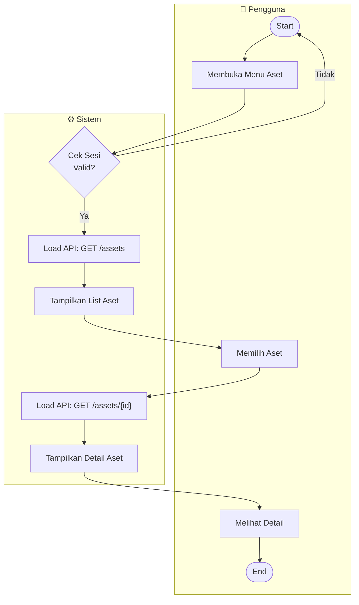
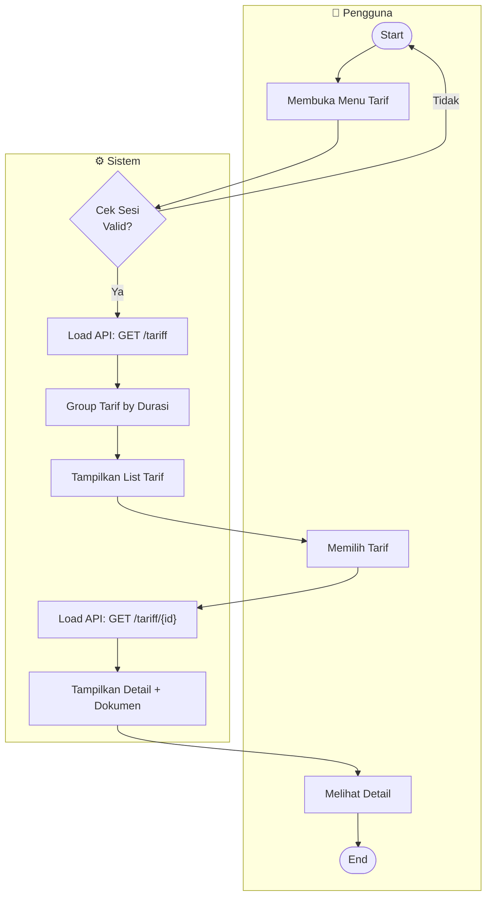

# BPMN Diagrams — TAPATUPA

> Business Process Model and Notation (BPMN) untuk tiga use case utama di aplikasi TAPATUPA

---

## 📑 Daftar Isi

1. [UC-04: Lihat Aset Retribusi](#uc-04--lihat-aset-retribusi)
2. [UC-05: Lihat Tarif Sewa](#uc-05--lihat-tarif-sewa)
3. [UC-07: Lihat Daftar Permohonan](#uc-07--lihat-daftar-permohonan)

---

## UC-04 💼 Lihat Aset Retribusi

### BPMN Flow

### Task Breakdown

| Task | Aktor | Deskripsi | Input | Output |
|----|-------|-----------|-------|--------|
| T-04.1 | Sistem | Cek validitas sesi user | Token | Valid/Invalid |
| T-04.2 | Sistem | Load daftar aset dari API | - | Assets List |
| T-04.3 | Sistem | Parse data aset | JSON | Asset Objects |
| T-04.4 | Pengguna | Membuka menu aset | Tap/Click | Request aset |
| T-04.5 | Sistem | Render list aset di UI | Asset Objects | UI List |
| T-04.6 | Pengguna | Memilih aset | Tap/Click | Selected Asset ID |
| T-04.7 | Sistem | Load detail aset | Asset ID | Asset Detail |
| T-04.8 | Sistem | Render detail aset | Detail Data | UI Detail |
| T-04.9 | Pengguna | Melihat detail & navigasi | Touch | Next Action |

### API Reference

**GET /api/v1/assets**
- Response: List aset dengan foto, nama, lokasi, status
  
**GET /api/v1/assets/{id}**
- Response: Detail aset lengkap dengan fasilitas dan harga

---

## UC-05 💰 Lihat Tarif Sewa

### BPMN Flow

### Task Breakdown

| Task | Aktor | Deskripsi | Input | Output |
|----|-------|-----------|-------|--------|
| T-05.1 | Sistem | Cek validitas sesi user | Token | Valid/Invalid |
| T-05.2 | Sistem | Load daftar tarif dari API | - | Tariff List |
| T-05.3 | Sistem | Group tarif by durasi | Tariff Array | Grouped Data |
| T-05.4 | Pengguna | Membuka menu tarif | Tap/Click | Request tarif |
| T-05.5 | Sistem | Render list tarif di UI | Tariff Objects | UI List |
| T-05.6 | Pengguna | Memilih tarif | Tap/Click | Selected Tariff ID |
| T-05.7 | Sistem | Load detail tarif + dokumen | Tariff ID | Tariff Detail |
| T-05.8 | Sistem | Render detail tarif | Detail Data | UI Detail |
| T-05.9 | Pengguna | Lihat detail & download dokumen | Touch | Next Action |

### API Reference

**GET /api/v1/tariff**
- Response: List tarif dengan durasi, harga, satuan

**GET /api/v1/tariff/{id}**
- Response: Detail tarif lengkap dengan dokumen dan kondisi

---

## UC-07 📌 Lihat Daftar Permohonan

### BPMN Flow

### Task Breakdown

| Task | Aktor | Deskripsi | Input | Output |
|----|-------|-----------|-------|--------|
| T-07.1 | Sistem | Cek validitas sesi user | Token | Valid/Invalid |
| T-07.2 | Sistem | Load daftar permohonan dari API | - | Request List |
| T-07.3 | Sistem | Parse data permohonan | JSON | Request Objects |
| T-07.4 | Pengguna | Membuka menu permohonan | Tap/Click | Request data |
| T-07.5 | Sistem | Render list permohonan + status | Request Objects | UI List |
| T-07.6 | Pengguna | Memilih permohonan | Tap/Click | Selected Request ID |
| T-07.7 | Sistem | Load detail permohonan | Request ID | Request Detail |
| T-07.8 | Sistem | Evaluasi status permohonan | Status Value | Status-Specific UI |
| T-07.9 | Sistem | Render detail permohonan | Detail Data | UI Detail |
| T-07.10 | Pengguna | Melihat detail & dokumen | Touch | Next Action |

### API Reference

**GET /api/v1/requests**
- Response: List permohonan user dengan status dan nomor request

**GET /api/v1/requests/{id}**
- Response: Detail permohonan lengkap dengan dokumen dan status

---

## � Status Permohonan

| Status | Deskripsi | Aksi Lanjut |
|--------|-----------|------------|
| BARU | Permohonan baru, menunggu review admin | Tunggu atau ubah |
| PROSES | Sedang diverifikasi admin | Tunggu hasil verifikasi |
| DISETUJUI | Disetujui, lanjut ke perjanjian | Lihat perjanjian & bayar |
| DITOLAK | Ditolak, bisa revisi & buat ulang | Edit & kirim ulang |

---

## 📚 References

- **Dokumen Terkait:** [USE_CASE_SCENARIOS.md](USE_CASE_SCENARIOS.md)
- **Database Schema:** [DATABASE_DIAGRAM.md](DATABASE_DIAGRAM.md)

---

**Dokumen ini dibuat pada:** 1 April 2026  
**Versi:** 2.0 (Simplified BPMN)  
**Status:** ✅ Complete

