# BPMN Diagrams — TAPATUPA

> Business Process Model and Notation (BPMN) untuk tiga use case utama di aplikasi TAPATUPA

---

## 📑 Daftar Isi

**User Flows:**
1. [UC-01: Login](#uc-01--login)
2. [UC-02: Registrasi](#uc-02--registrasi)
3. [UC-03: Dashboard Home](#uc-03--dashboard-home)
4. [UC-04: Lihat Aset Retribusi](#uc-04--lihat-aset-retribusi)
5. [UC-05: Lihat Tarif Sewa](#uc-05--lihat-tarif-sewa)
6. [UC-06: Buat Permohonan Sewa](#uc-06--buat-permohonan-sewa)
7. [UC-07: Lihat Daftar Permohonan](#uc-07--lihat-daftar-permohonan)
8. [UC-08: Lihat Perjanjian & Tagihan](#uc-08--lihat-perjanjian--tagihan)
9. [UC-09: Bayar Tagihan](#uc-09--bayar-tagihan)
10. [UC-10: Lihat Riwayat Pembayaran](#uc-10--lihat-riwayat-pembayaran)
11. [UC-11: Profile & Logout](#uc-11--profile--logout)

**Admin Flows:**
12. [UC-A1: Login Admin](#uc-a1--login-admin)
13. [UC-A2: Dashboard Admin](#uc-a2--dashboard-admin)
14. [UC-A3: Monitoring Permohonan (Admin)](#uc-a3--monitoring-permohonan-admin)
15. [UC-A4: Monitoring Perjanjian & Tagihan](#uc-a4--monitoring-perjanjian--tagihan)
16. [UC-A5: Monitoring Pembayaran](#uc-a5--monitoring-pembayaran)

---

## UC-01 🔐 Login

### BPMN Flow

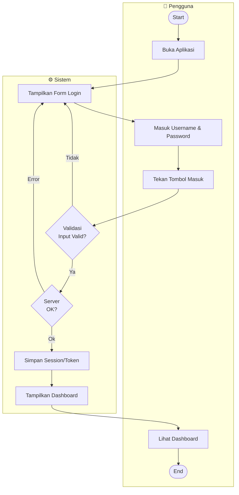

### Task Breakdown

| Task | Aktor | Deskripsi | Input | Output |
|----|-------|-----------|-------|--------|
| T-01.1 | Pengguna | Membuka aplikasi | Launch App | Login Page |
| T-01.2 | Sistem | Tampilkan form login | - | Form UI |
| T-01.3 | Pengguna | Isi username & password | Credentials | Input Fields |
| T-01.4 | Sistem | Validasi input | Credentials | Valid/Invalid |
| T-01.5 | Sistem | Send login ke server | Valid Creds | Response |
| T-01.6 | Sistem | Simpan token/session | Token | Session Saved |
| T-01.7 | Sistem | Tampilkan dashboard home | Session | Home Dashboard |
| T-01.8 | Pengguna | Melihat dashboard | Touch | Ready to Use |

### API Reference

**POST /api/v1/auth/login**
- Request: username, password
- Response: token, user_data, session_id

---

## UC-02 📝 Registrasi

### BPMN Flow

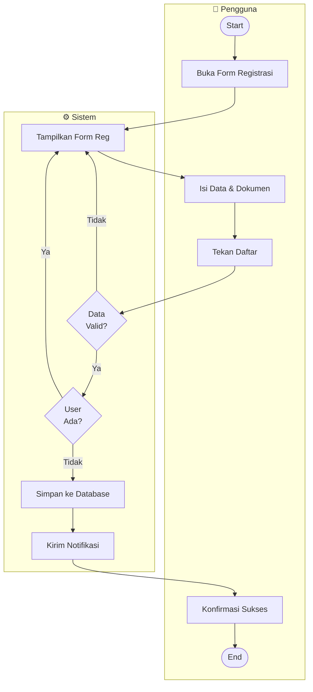

### Task Breakdown

| Task | Aktor | Deskripsi | Input | Output |
|----|-------|-----------|-------|--------|
| T-02.1 | Pengguna | Buka halaman registrasi | Tap Register | Reg Form |
| T-02.2 | Sistem | Tampilkan form registrasi | - | Form UI |
| T-02.3 | Pengguna | Isi data identitas | Form Fields | Input Completed |
| T-02.4 | Sistem | Validasi kelengkapan | Data | Valid/Invalid |
| T-02.5 | Sistem | Cek akun duplicate | Email/Username | Exists/Not |
| T-02.6 | Sistem | Simpan akun baru | Valid Data | User Created |
| T-02.7 | Sistem | Kirim konfirmasi | Email | Email Sent |
| T-02.8 | Pengguna | Lihat notifikasi sukses | Message | Ready to Login |

### API Reference

**POST /api/v1/auth/register**
- Request: name, email, phone, username, password
- Response: user_id, confirmation_message

---

## UC-03 🏠 Dashboard Home

### BPMN Flow

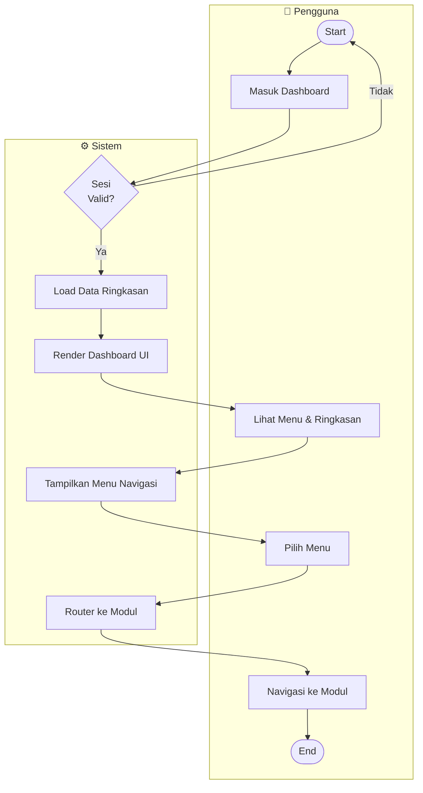

### Task Breakdown

| Task | Aktor | Deskripsi | Input | Output |
|----|-------|-----------|-------|--------|
| T-03.1 | Sistem | Cek validitas sesi | Token | Valid/Invalid |
| T-03.2 | Sistem | Load ringkasan data | User ID | Summary Data |
| T-03.3 | Sistem | Render UI dashboard | Data | Dashboard UI |
| T-03.4 | Pengguna | Lihat dashboard utama | Display | Overview |
| T-03.5 | Sistem | Tampilkan menu navigasi | - | Menu Items |
| T-03.6 | Pengguna | Pilih menu fitur | Tap/Click | Selected Menu |
| T-03.7 | Sistem | Route ke modul | Menu ID | Navigation |
| T-03.8 | Pengguna | Akses modul terpilih | Navigation | Modul Page |

### API Reference

**GET /api/v1/dashboard/summary**
- Response: pending_requests, invoices, active_agreements

---

## UC-04 💼 Lihat Aset Retribusi

### BPMN Flow

### Task Breakdown

| Task | Aktor | Deskripsi | Input | Output |
|----|-------|-----------|-------|--------|
| T-04.1 | Sistem | Cek validitas sesi user | Token | Valid/Invalid |
| T-04.2 | Sistem | Load daftar aset dari API | - | Assets List |
| T-04.3 | Sistem | Parse data aset | JSON | Asset Objects |
| T-04.4 | Pengguna | Membuka menu aset | Tap/Click | Request aset |
| T-04.5 | Sistem | Render list aset di UI | Asset Objects | UI List |
| T-04.6 | Pengguna | Memilih aset | Tap/Click | Selected Asset ID |
| T-04.7 | Sistem | Load detail aset | Asset ID | Asset Detail |
| T-04.8 | Sistem | Render detail aset | Detail Data | UI Detail |
| T-04.9 | Pengguna | Melihat detail & navigasi | Touch | Next Action |

### API Reference

**GET /api/v1/assets**
- Response: List aset dengan foto, nama, lokasi, status
  
**GET /api/v1/assets/{id}**
- Response: Detail aset lengkap dengan fasilitas dan harga

---

## UC-05 💰 Lihat Tarif Sewa

### BPMN Flow

### Task Breakdown

| Task | Aktor | Deskripsi | Input | Output |
|----|-------|-----------|-------|--------|
| T-05.1 | Sistem | Cek validitas sesi user | Token | Valid/Invalid |
| T-05.2 | Sistem | Load daftar tarif dari API | - | Tariff List |
| T-05.3 | Sistem | Group tarif by durasi | Tariff Array | Grouped Data |
| T-05.4 | Pengguna | Membuka menu tarif | Tap/Click | Request tarif |
| T-05.5 | Sistem | Render list tarif di UI | Tariff Objects | UI List |
| T-05.6 | Pengguna | Memilih tarif | Tap/Click | Selected Tariff ID |
| T-05.7 | Sistem | Load detail tarif + dokumen | Tariff ID | Tariff Detail |
| T-05.8 | Sistem | Render detail tarif | Detail Data | UI Detail |
| T-05.9 | Pengguna | Lihat detail & download dokumen | Touch | Next Action |

### API Reference

**GET /api/v1/tariff**
- Response: List tarif dengan durasi, harga, satuan

**GET /api/v1/tariff/{id}**
- Response: Detail tarif lengkap dengan dokumen dan kondisi

---

## UC-06 📋 Buat Permohonan Sewa

### BPMN Flow

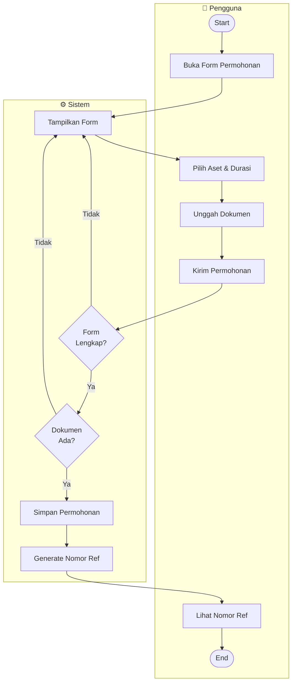

### Task Breakdown

| Task | Aktor | Deskripsi | Input | Output |
|----|-------|-----------|-------|--------|
| T-06.1 | Pengguna | Buka form permohonan | Tap | Form UI |
| T-06.2 | Sistem | Tampilkan form kosong | - | Form Template |
| T-06.3 | Pengguna | Pilih aset & durasi | Selection | Selected Items |
| T-06.4 | Pengguna | Unggah dokumen pendukung | File | Uploaded Files |
| T-06.5 | Pengguna | Submit permohonan | Send | Submission |
| T-06.6 | Sistem | Validasi kelengkapan | Form Data | Valid/Invalid |
| T-06.7 | Sistem | Simpan ke database | Valid Data | Saved |
| T-06.8 | Sistem | Generate nomor referensi | ID | Ref Number |
| T-06.9 | Pengguna | Lihat konfirmasi | Display | Success Msg |

### API Reference

**POST /api/v1/requests**
- Request: asset_id, start_date, end_date, documents[]
- Response: request_id, request_number

---

## UC-07 📌 Lihat Daftar Permohonan

### BPMN Flow

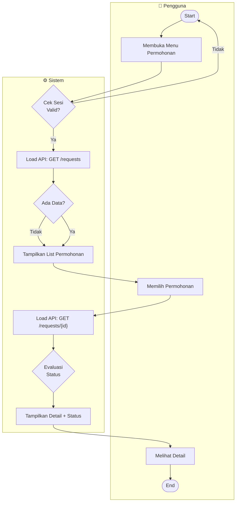

### Task Breakdown

| Task | Aktor | Deskripsi | Input | Output |
|----|-------|-----------|-------|--------|
| T-07.1 | Sistem | Cek validitas sesi user | Token | Valid/Invalid |
| T-07.2 | Sistem | Load daftar permohonan dari API | - | Request List |
| T-07.3 | Sistem | Parse data permohonan | JSON | Request Objects |
| T-07.4 | Pengguna | Membuka menu permohonan | Tap/Click | Request data |
| T-07.5 | Sistem | Render list permohonan + status | Request Objects | UI List |
| T-07.6 | Pengguna | Memilih permohonan | Tap/Click | Selected Request ID |
| T-07.7 | Sistem | Load detail permohonan | Request ID | Request Detail |
| T-07.8 | Sistem | Evaluasi status permohonan | Status Value | Status-Specific UI |
| T-07.9 | Sistem | Render detail permohonan | Detail Data | UI Detail |
| T-07.10 | Pengguna | Melihat detail & dokumen | Touch | Next Action |

### API Reference

**GET /api/v1/requests**
- Response: List permohonan user dengan status dan nomor request

**GET /api/v1/requests/{id}**
- Response: Detail permohonan lengkap dengan dokumen dan status

---

## UC-08 📜 Lihat Perjanjian & Tagihan

### BPMN Flow

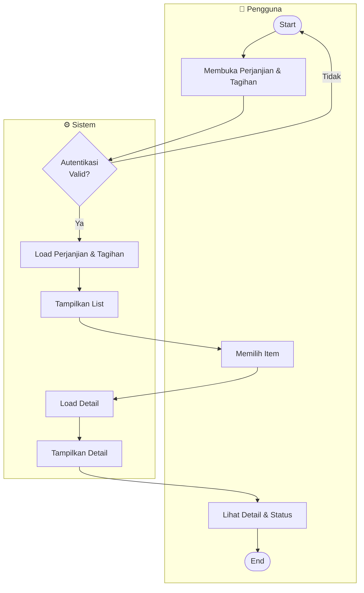

### Task Breakdown

| Task | Aktor | Deskripsi | Input | Output |
|----|-------|-----------|-------|--------|
| T-08.1 | Sistem | Validasi sesi user | Token | Valid/Invalid |
| T-08.2 | Sistem | Load perjanjian & tagihan | User ID | Data List |
| T-08.3 | Pengguna | Buka menu perjanjian | Tap | Menu Page |
| T-08.4 | Sistem | Tampilkan list perjanjian | Data | List UI |
| T-08.5 | Pengguna | Pilih perjanjian/tagihan | Tap/Click | Selected ID |
| T-08.6 | Sistem | Load detail lengkap | Item ID | Detail Data |
| T-08.7 | Sistem | Render detail view | Data | Detail UI |
| T-08.8 | Pengguna | Lihat detail dan status pembayaran | Display | View Details |

### API Reference

**GET /api/v1/agreements**
- Response: List perjanjian user dengan status tagihan

**GET /api/v1/agreements/{id}**
- Response: Detail perjanjian, tagihan, dan dokumen

---

## UC-09 💳 Bayar Tagihan

### BPMN Flow

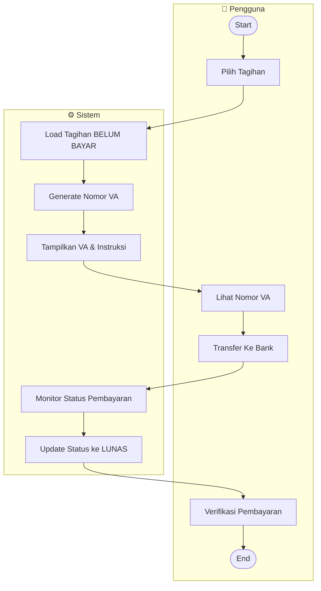

### Task Breakdown

| Task | Aktor | Deskripsi | Input | Output |
|----|-------|-----------|-------|--------|
| T-09.1 | Pengguna | Pilih tagihan untuk bayar | Tap | Invoice Selected |
| T-09.2 | Sistem | Load data tagihan | Invoice ID | Invoice Data |
| T-09.3 | Sistem | Generate VA otomatis | Amount | VA Number |
| T-09.4 | Sistem | Tampilkan VA & detail | VA Data | Display Page |
| T-09.5 | Pengguna | Lihat nomor VA & instruksi | Display | VA Info |
| T-09.6 | Pengguna | Transfer lewat bank | Bank App | Payment Sent |
| T-09.7 | Sistem | Monitor status pembayaran | VA | Payment Status |
| T-09.8 | Sistem | Update status tagihan | Confirmed | Status LUNAS |

### API Reference

**POST /api/v1/payments/create-va**
- Request: invoice_id, amount
- Response: va_number, expiry_date

**GET /api/v1/payments/check-status**
- Response: payment_status (PENDING/SUCCESS/FAILED)

---

## UC-10 🧾 Lihat Riwayat Pembayaran

### BPMN Flow

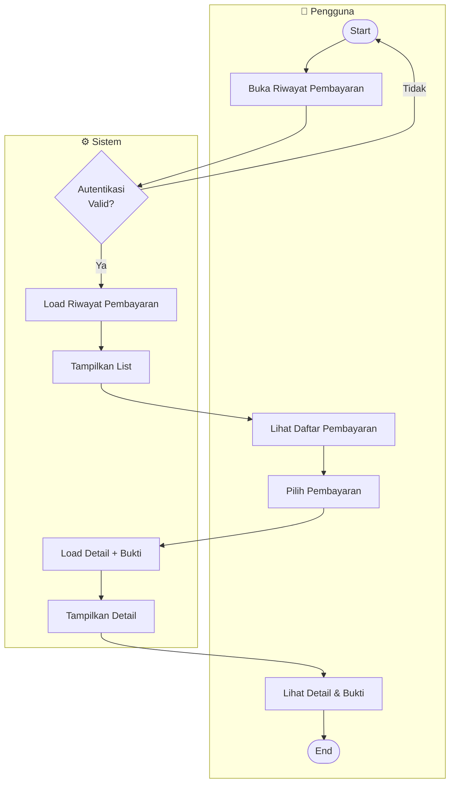

### Task Breakdown

| Task | Aktor | Deskripsi | Input | Output |
|----|-------|-----------|-------|--------|
| T-10.1 | Sistem | Validasi sesi | Token | Valid/Invalid |
| T-10.2 | Sistem | Load riwayat pembayaran | User ID | Payment List |
| T-10.3 | Pengguna | Buka menu riwayat | Tap | Menu Page |
| T-10.4 | Sistem | Tampilkan list pembayaran | Data | List UI |
| T-10.5 | Pengguna | Pilih pembayaran | Tap/Click | Selected ID |
| T-10.6 | Sistem | Load detail + bukti | Payment ID | Detail Data |
| T-10.7 | Sistem | Render detail view | Data | Detail UI |
| T-10.8 | Pengguna | Lihat detail & bukti transaksi | Display | Receipt View |

### API Reference

**GET /api/v1/payments/history**
- Response: List pembayaran dengan tanggal, nominal, status

**GET /api/v1/payments/{id}/receipt**
- Response: Detail pembayaran dan bukti transaksi

---

## UC-11 👤 Profile & Logout

### BPMN Flow

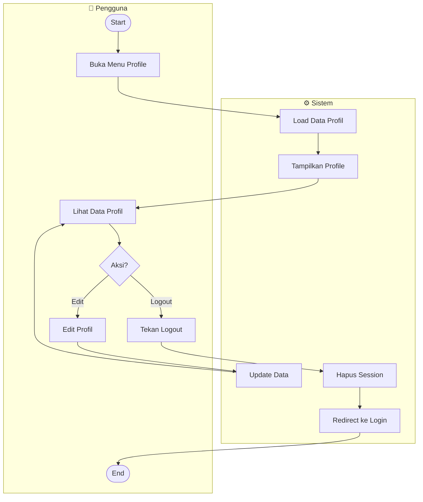

### Task Breakdown

| Task | Aktor | Deskripsi | Input | Output |
|----|-------|-----------|-------|--------|
| T-11.1 | Pengguna | Buka menu profile | Tap | Profile Page |
| T-11.2 | Sistem | Load data user | User ID | User Data |
| T-11.3 | Sistem | Tampilkan profil | Data | Profile UI |
| T-11.4 | Pengguna | Lihat data profil | Display | Profile Info |
| T-11.5 | Pengguna | Edit profil (opsional) | Input | Updated Data |
| T-11.6 | Sistem | Update data ke server | New Data | Saved |
| T-11.7 | Pengguna | Tekan tombol logout | Tap | Logout Action |
| T-11.8 | Sistem | Hapus session dan token | Session | Session Cleared |
| T-11.9 | Sistem | Redirect ke login | - | Login Page |

### API Reference

**GET /api/v1/profile**
- Response: User profile data (name, email, phone, etc)

**PUT /api/v1/profile**
- Request: Updated user data
- Response: Updated profile

**POST /api/v1/auth/logout**
- Response: Logout confirmation

---

## UC-A1 🔐 Login Admin

### BPMN Flow

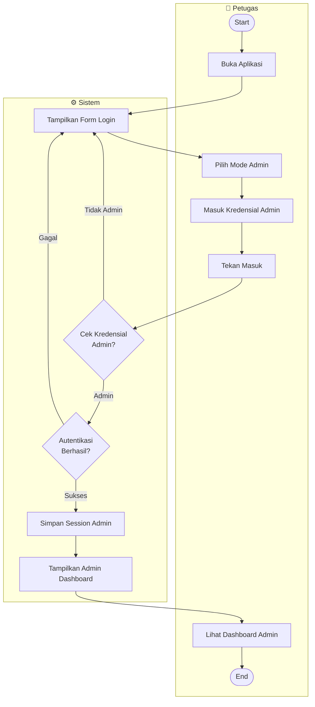

### Task Breakdown

| Task | Aktor | Deskripsi | Input | Output |
|----|-------|-----------|-------|--------|
| T-A1.1 | Petugas | Buka aplikasi | Launch | App Login |
| T-A1.2 | Sistem | Tampilkan form login | - | Login Form |
| T-A1.3 | Petugas | Pilih mode admin | Selection | Admin Mode |
| T-A1.4 | Petugas | Masuk username & password admin | Credentials | Input Filled |
| T-A1.5 | Sistem | Validasi kredensial admin | Credentials | Valid/Invalid |
| T-A1.6 | Sistem | Autentikasi ke server | Validated | Response |
| T-A1.7 | Sistem | Simpan admin session | Token | Session Saved |
| T-A1.8 | Sistem | Tampilkan admin dashboard | Session | Admin Dashboard |

### API Reference

**POST /api/v1/auth/admin-login**
- Request: username, password, role=admin
- Response: admin_token, admin_data

---

## UC-A2 📊 Dashboard Admin

### BPMN Flow

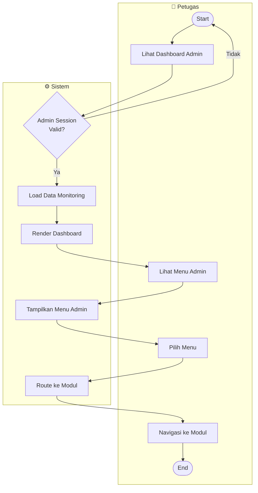

### Task Breakdown

| Task | Aktor | Deskripsi | Input | Output |
|----|-------|-----------|-------|--------|
| T-A2.1 | Sistem | Validasi admin session | Admin Token | Valid/Invalid |
| T-A2.2 | Sistem | Load ringkasan monitoring | - | Summary Data |
| T-A2.3 | Sistem | Render admin dashboard | Data | Dashboard UI |
| T-A2.4 | Petugas | Lihat dashboard admin | Display | Overview |
| T-A2.5 | Sistem | Tampilkan menu admin | - | Menu Items |
| T-A2.6 | Petugas | Pilih modul admin | Tap/Click | Selected Module |
| T-A2.7 | Sistem | Route ke modul | Module ID | Navigation |
| T-A2.8 | Petugas | Akses modul admin | Navigation | Modul Page |

### API Reference

**GET /api/v1/admin/dashboard**
- Response: pending_requests, total_payments, active_agreements

---

## UC-A3 📋 Monitoring Permohonan (Admin)

### BPMN Flow

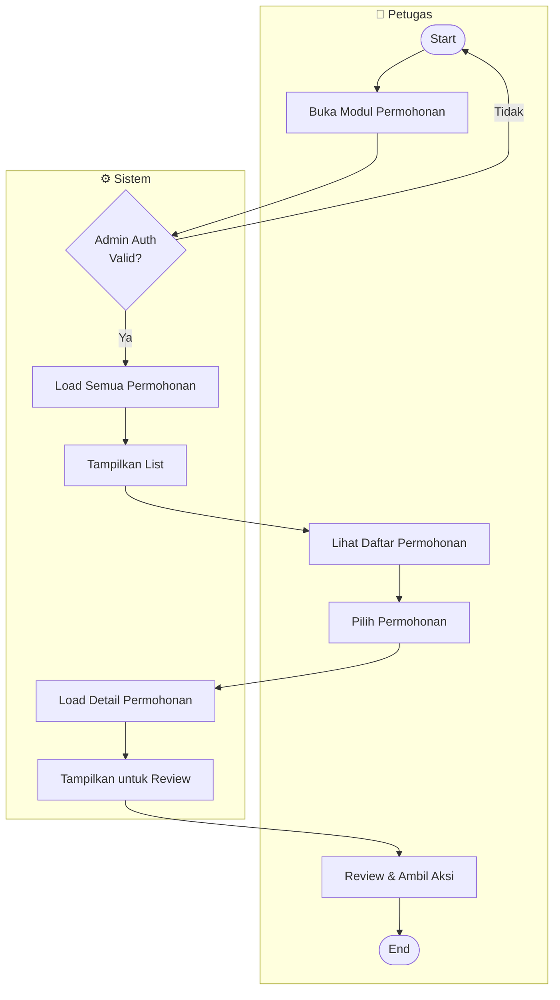

### Task Breakdown

| Task | Aktor | Deskripsi | Input | Output |
|----|-------|-----------|-------|--------|
| T-A3.1 | Sistem | Validasi admin session | Admin Token | Valid/Invalid |
| T-A3.2 | Sistem | Load semua permohonan | - | Request List |
| T-A3.3 | Petugas | Buka modul permohonan | Tap | Modul Page |
| T-A3.4 | Sistem | Filter & tampilkan list | Filter | Filtered List |
| T-A3.5 | Petugas | Lihat daftar permohonan | Display | List View |
| T-A3.6 | Petugas | Pilih permohonan | Tap/Click | Selected Request |
| T-A3.7 | Sistem | Load detail lengkap | Request ID | Detail Data |
| T-A3.8 | Petugas | Review & pilih aksi | Detail | Action (Approve/Reject) |

### API Reference

**GET /api/v1/admin/requests**
- Response: List semua permohonan dari semua user

**POST /api/v1/admin/requests/{id}/approve**
- Request: notes
- Response: Updated status

---

## UC-A4 📊 Monitoring Perjanjian & Tagihan

### BPMN Flow

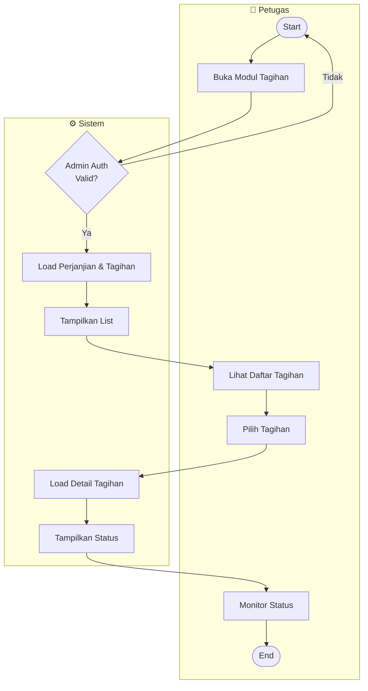

### Task Breakdown

| Task | Aktor | Deskripsi | Input | Output |
|----|-------|-----------|-------|--------|
| T-A4.1 | Sistem | Validasi admin session | Admin Token | Valid/Invalid |
| T-A4.2 | Sistem | Load perjanjian & tagihan | - | Data List |
| T-A4.3 | Petugas | Buka modul tagihan | Tap | Modul Page |
| T-A4.4 | Sistem | Filter & tampilkan list | Filter | Filtered List |
| T-A4.5 | Petugas | Lihat daftar tagihan | Display | List View |
| T-A4.6 | Petugas | Pilih tagihan | Tap/Click | Selected Item |
| T-A4.7 | Sistem | Load detail lengkap | Item ID | Detail Data |
| T-A4.8 | Petugas | Monitor status pembayaran | Display | Status View |

### API Reference

**GET /api/v1/admin/agreements**
- Response: List perjanjian dengan status tagihan

**GET /api/v1/admin/invoices**
- Response: List tagihan dengan status pembayaran

---

## UC-A5 💰 Monitoring Pembayaran

### BPMN Flow

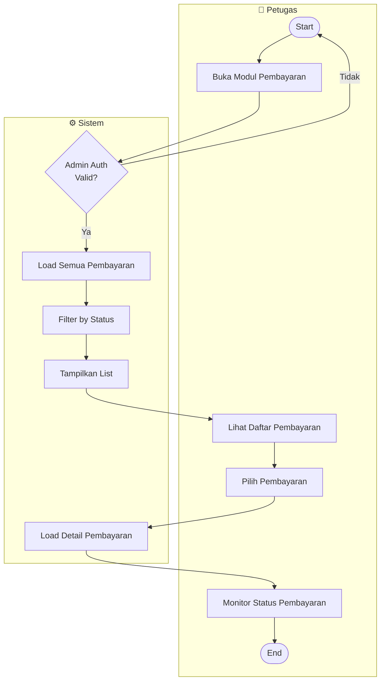

### Task Breakdown

| Task | Aktor | Deskripsi | Input | Output |
|----|-------|-----------|-------|--------|
| T-A5.1 | Sistem | Validasi admin session | Admin Token | Valid/Invalid |
| T-A5.2 | Sistem | Load semua pembayaran | - | Payment List |
| T-A5.3 | Petugas | Buka modul pembayaran | Tap | Modul Page |
| T-A5.4 | Sistem | Filter by status | Filter | Filtered List |
| T-A5.5 | Petugas | Lihat daftar pembayaran | Display | List View |
| T-A5.6 | Petugas | Pilih pembayaran | Tap/Click | Selected Payment |
| T-A5.7 | Sistem | Load detail pembayaran | Payment ID | Detail Data |
| T-A5.8 | Petugas | Monitor status pembayaran | Display | Payment Status |

### API Reference

**GET /api/v1/admin/payments**
- Response: List pembayaran dengan status dan nominal

**GET /api/v1/admin/payments/{id}**
- Response: Detail pembayaran dan bukti transaksi

### BPMN Flow

### Task Breakdown

| Task | Aktor | Deskripsi | Input | Output |
|----|-------|-----------|-------|--------|
| T-04.1 | Sistem | Cek validitas sesi user | Token | Valid/Invalid |
| T-04.2 | Sistem | Load daftar aset dari API | - | Assets List |
| T-04.3 | Sistem | Parse data aset | JSON | Asset Objects |
| T-04.4 | Pengguna | Membuka menu aset | Tap/Click | Request aset |
| T-04.5 | Sistem | Render list aset di UI | Asset Objects | UI List |
| T-04.6 | Pengguna | Memilih aset | Tap/Click | Selected Asset ID |
| T-04.7 | Sistem | Load detail aset | Asset ID | Asset Detail |
| T-04.8 | Sistem | Render detail aset | Detail Data | UI Detail |
| T-04.9 | Pengguna | Melihat detail & navigasi | Touch | Next Action |

### API Reference

**GET /api/v1/assets**
- Response: List aset dengan foto, nama, lokasi, status
  
**GET /api/v1/assets/{id}**
- Response: Detail aset lengkap dengan fasilitas dan harga

---

## UC-05 💰 Lihat Tarif Sewa

### BPMN Flow

### Task Breakdown

| Task | Aktor | Deskripsi | Input | Output |
|----|-------|-----------|-------|--------|
| T-05.1 | Sistem | Cek validitas sesi user | Token | Valid/Invalid |
| T-05.2 | Sistem | Load daftar tarif dari API | - | Tariff List |
| T-05.3 | Sistem | Group tarif by durasi | Tariff Array | Grouped Data |
| T-05.4 | Pengguna | Membuka menu tarif | Tap/Click | Request tarif |
| T-05.5 | Sistem | Render list tarif di UI | Tariff Objects | UI List |
| T-05.6 | Pengguna | Memilih tarif | Tap/Click | Selected Tariff ID |
| T-05.7 | Sistem | Load detail tarif + dokumen | Tariff ID | Tariff Detail |
| T-05.8 | Sistem | Render detail tarif | Detail Data | UI Detail |
| T-05.9 | Pengguna | Lihat detail & download dokumen | Touch | Next Action |

### API Reference

**GET /api/v1/tariff**
- Response: List tarif dengan durasi, harga, satuan

**GET /api/v1/tariff/{id}**
- Response: Detail tarif lengkap dengan dokumen dan kondisi

---

## UC-07 📌 Lihat Daftar Permohonan

### BPMN Flow

### Task Breakdown

| Task | Aktor | Deskripsi | Input | Output |
|----|-------|-----------|-------|--------|
| T-07.1 | Sistem | Cek validitas sesi user | Token | Valid/Invalid |
| T-07.2 | Sistem | Load daftar permohonan dari API | - | Request List |
| T-07.3 | Sistem | Parse data permohonan | JSON | Request Objects |
| T-07.4 | Pengguna | Membuka menu permohonan | Tap/Click | Request data |
| T-07.5 | Sistem | Render list permohonan + status | Request Objects | UI List |
| T-07.6 | Pengguna | Memilih permohonan | Tap/Click | Selected Request ID |
| T-07.7 | Sistem | Load detail permohonan | Request ID | Request Detail |
| T-07.8 | Sistem | Evaluasi status permohonan | Status Value | Status-Specific UI |
| T-07.9 | Sistem | Render detail permohonan | Detail Data | UI Detail |
| T-07.10 | Pengguna | Melihat detail & dokumen | Touch | Next Action |

### API Reference

**GET /api/v1/requests**
- Response: List permohonan user dengan status dan nomor request

**GET /api/v1/requests/{id}**
- Response: Detail permohonan lengkap dengan dokumen dan status

---

## � Status Permohonan

| Status | Deskripsi | Aksi Lanjut |
|--------|-----------|------------|
| BARU | Permohonan baru, menunggu review admin | Tunggu atau ubah |
| PROSES | Sedang diverifikasi admin | Tunggu hasil verifikasi |
| DISETUJUI | Disetujui, lanjut ke perjanjian | Lihat perjanjian & bayar |
| DITOLAK | Ditolak, bisa revisi & buat ulang | Edit & kirim ulang |

---

## 📚 References

- **Dokumen Terkait:** [USE_CASE_SCENARIOS.md](USE_CASE_SCENARIOS.md)
- **Database Schema:** [DATABASE_DIAGRAM.md](DATABASE_DIAGRAM.md)

---

**Dokumen ini dibuat pada:** 1 April 2026  
**Versi:** 2.0 (Simplified BPMN)  
**Status:** ✅ Complete

