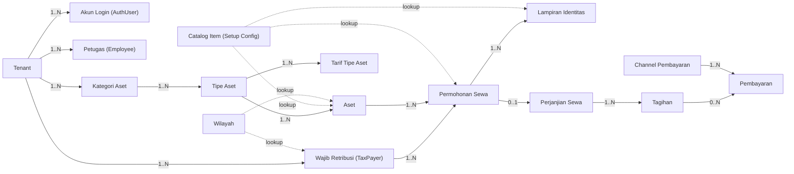
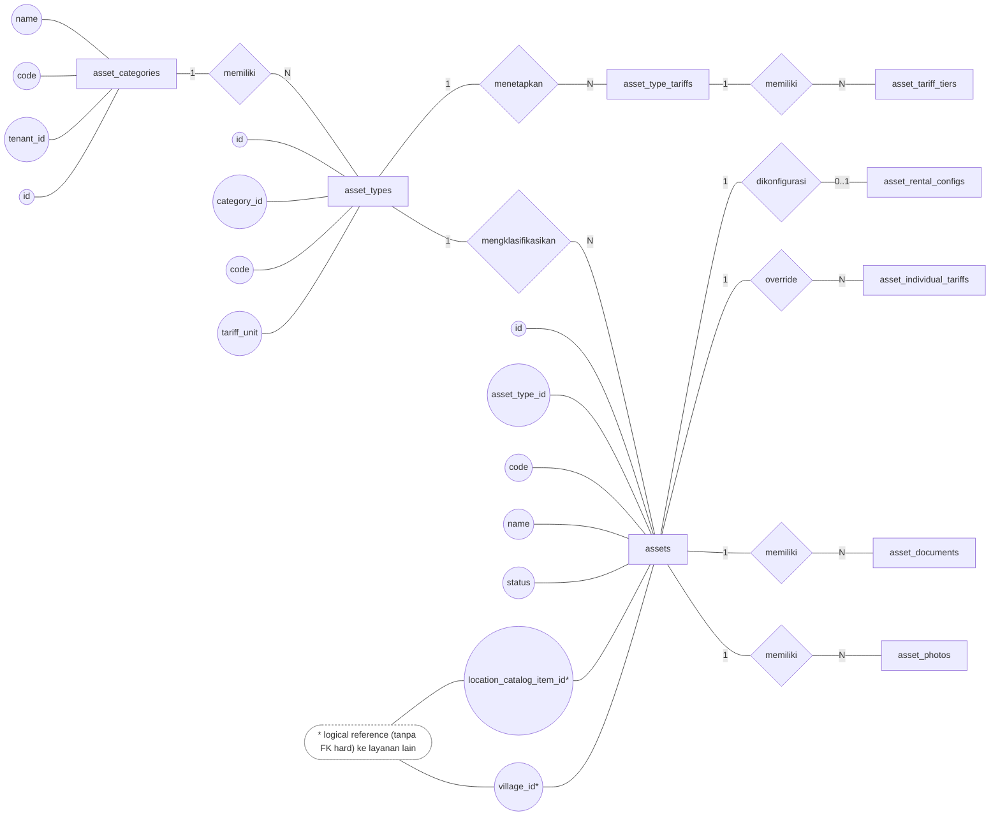
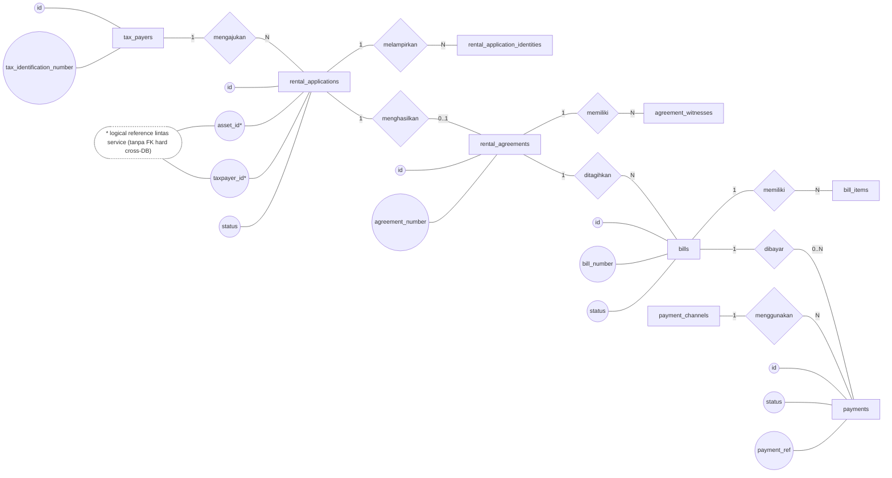
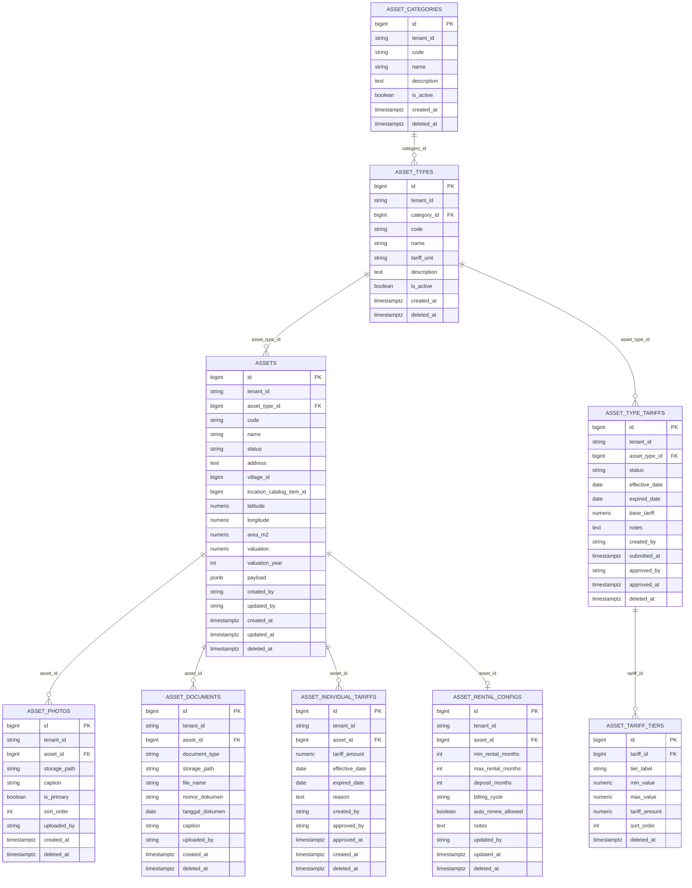
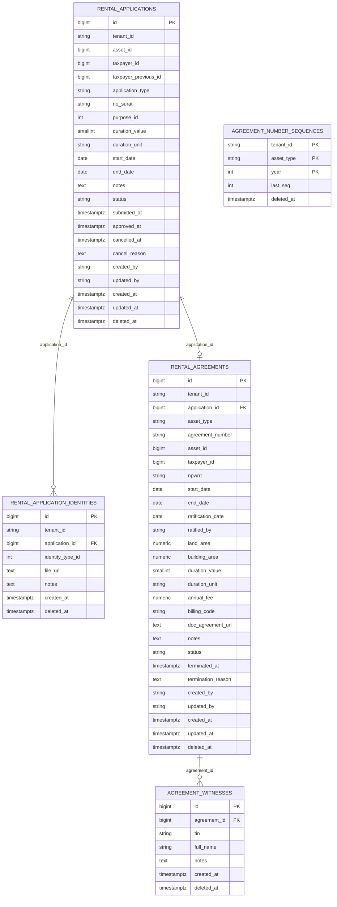
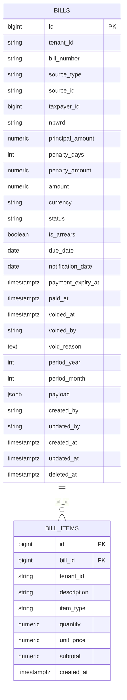
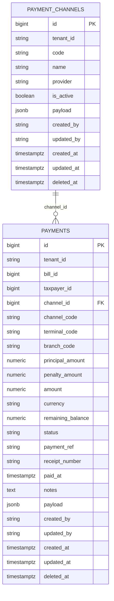
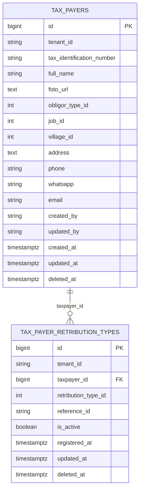
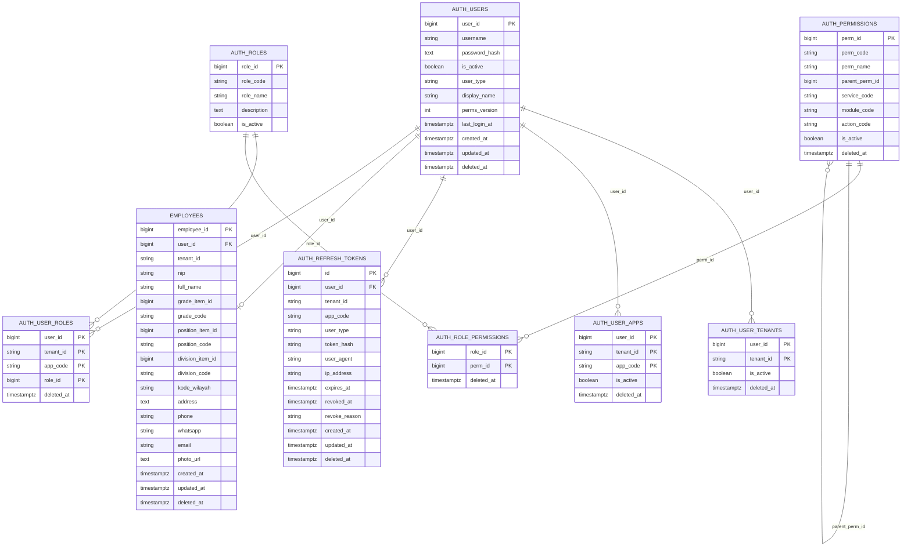
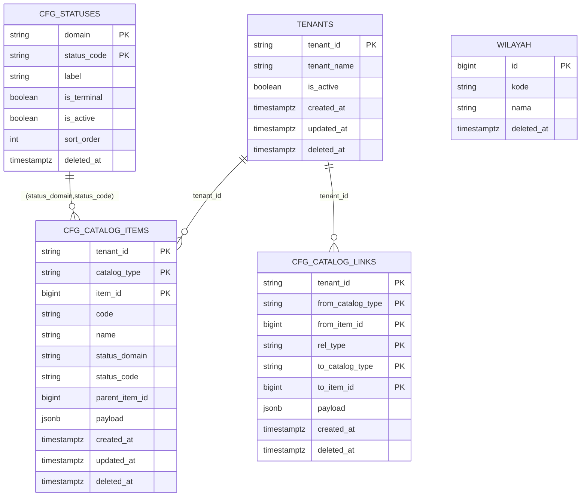

# DATABASE_DIAGRAM — CDM / ERD / PDM (TAPATUPA)

> Cara melihat seperti **laporan** di VS Code:
>
> - Buka file ini lalu tekan **Ctrl+Shift+V** (Markdown: Open Preview)
> - Atau klik kanan tab file → **Open Preview to the Side**

Dokumen ini merangkum **model data** yang relevan dengan seluruh use case di TAPATUPA (lihat `tapatupa/docs/USE_CASE_SCENARIOS.md`), dan disusun berdasarkan schema SQL yang ada di repo backend `pajak-retribusi-platform`.

## Sumber (berdasarkan schema SQL)

Tabel-tabel utama yang mendukung use case TAPATUPA tersebar di beberapa database/service:

- `asset_db` — `asset-service` (aset, tarif, foto, dokumen, konfigurasi sewa)
  - `pajak-retribusi-platform/services/asset-service/database/sql/001_asset_schema.sql`
  - `pajak-retribusi-platform/services/asset-service/database/sql/008_asset_location.sql`
  - `pajak-retribusi-platform/services/asset-service/database/sql/010_rename_subdistrict_to_village.sql`
- `rental_db` — `rental-service` (permohonan sewa, lampiran identitas, perjanjian)
  - `pajak-retribusi-platform/services/rental-service/database/sql/001_rental_schema.sql`
- `bill_db` — `bill-service` (tagihan + rincian item)
  - `pajak-retribusi-platform/services/bill-service/database/sql/001_bill_schema.sql`
- `payment_db` — `payment-service` (transaksi pembayaran + channel)
  - `pajak-retribusi-platform/services/payment-service/database/sql/001_payment_schema.sql`
- `tax_payer_db` — `tax-payer-service` (wajib retribusi + registrasi jenis retribusi)
  - `pajak-retribusi-platform/services/tax-payer-service/database/schema.sql`
- `auth_db` — `auth-service` (akun login + profil pegawai/petugas)
  - `pajak-retribusi-platform/services/auth-service/database/sql/001_auth_db.sql`
  - `pajak-retribusi-platform/services/auth-service/database/sql/010_employees_schema.sql`
- `setup_config_db` — `setup_config_service` (tenant, generic catalog, wilayah)
  - `pajak-retribusi-platform/services/setup_config_service/database/sql/001_setup_config.sql`
  - `pajak-retribusi-platform/services/setup_config_service/database/sql/010_wilayah.sql`

## Catatan penting

- Mayoritas service menggunakan `tenant_id` untuk isolasi multi-tenant.
- **Tidak ada FK hard lintas database** (mis. `rental_applications.asset_id` tidak FK ke `asset_db.assets.id`). Hubungan lintas-service adalah **logical reference** dan di-enforce di level aplikasi/service.
- Banyak field referensi master data memakai `setup_config_db.cfg_catalog_items` (contoh: `IDENTITY_TYPE`, `RENTAL_PURPOSE`, `ASSET_LOCATION`, `OBLIGOR_TYPE`, `JOB`, `RETRIBUTION_TYPE`).
- Referensi wilayah tidak seragam antar domain:
  - `asset_db.assets.village_id` menyimpan **Emsifa ID 10 digit** (lihat komentar di schema `asset-service`).
  - `tax_payer_db.tax_payers.village_id` menyimpan logical reference ke `setup_config_db.wilayah.id`.
  - `auth_db.employees.kode_wilayah` menyimpan logical reference ke `setup_config_db.wilayah.kode`.

---

## CDM (Conceptual Data Model) — Lintas Use Case

CDM ini memetakan **konsep bisnis** utama yang muncul di use case: autentikasi, lihat aset & tarif, ajukan permohonan, perjanjian & tagihan, pembayaran VA otomatis, history pembayaran, serta pengelolaan oleh petugas.

---

## ERD (Chen Notation) — Domain Aset (asset-service)

Legenda bentuk:

- **Entity**: kotak
- **Relationship**: diamond
- **Attribute**: lingkaran

---

## ERD (Chen Notation) — Sewa, Tagihan, Pembayaran (lintas service)

Diagram ini menekankan relasi data yang dipakai oleh use case UC-04 s/d UC-08.

---

## PDM (Physical Data Model) — Per Service / Database

PDM di bawah **ringkas (kolom inti)** dan mengikuti struktur tabel pada masing-masing database. Relasi yang ditunjukkan sebagai `FK` adalah relasi **di dalam database yang sama**.

### PDM — asset_db (asset-service)

### PDM — rental_db (rental-service)

### PDM — bill_db (bill-service)

### PDM — payment_db (payment-service)

### PDM — tax_payer_db (tax-payer-service)

### PDM — auth_db (auth-service)

### PDM — setup_config_db (setup_config_service)

---

## Ringkasan Relasi Lintas-Service (Logical Reference)

Relasi berikut dipakai oleh use case, tetapi **tidak** dibangun sebagai FK hard (karena beda database):

- `rental_applications.asset_id` → `asset-service.assets.id`
- `rental_applications.taxpayer_id` → `tax_payers.id`
- `rental_agreements.asset_id` → `asset-service.assets.id`
- `rental_agreements.taxpayer_id` → `tax_payers.id`
- `bills.source_type='rental'` + `bills.source_id` → identitas objek di rental-service (mis. `rental_agreements.id` sesuai kontrak integrasi)
- `payments.bill_id` → `bill-service.bills.id`
- `payments.taxpayer_id` → `tax_payers.id`
- `assets.village_id` → ID wilayah (Emsifa ID 10 digit) untuk resolusi nama lokasi (tanpa FK)
- `tax_payers.village_id` → `setup_config_service.wilayah.id` (tanpa FK)
- `employees.kode_wilayah` → `setup_config_service.wilayah.kode` (tanpa FK)
- `assets.location_catalog_item_id`, `rental_application_identities.identity_type_id`, `rental_applications.purpose_id`, `tax_payers.job_id`, dll → `cfg_catalog_items` (setup-config)
