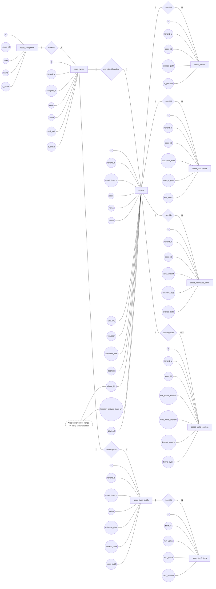
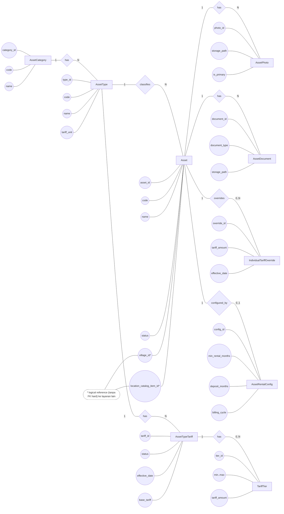

# DATABASE_DIAGRAM — ERD (Notasi Chen) asset-service

> Cara melihat seperti **laporan** di VS Code:
> - Buka file ini lalu tekan **Ctrl+Shift+V** (Markdown: Open Preview)
> - Atau klik kanan tab file → **Open Preview to the Side**

Dokumen ini menggambarkan **ERD notasi Chen** untuk database `asset_db` milik `asset-service` (berdasarkan definisi tabel di `pajak-retribusi-platform/services/asset-service/database/sql/001_asset_schema.sql` dan perubahan lanjutan seperti `008_asset_location.sql`).

Catatan:
- `tenant_id` dipakai hampir di semua tabel untuk isolasi multi-tenant.
- `assets.village_id` dan `assets.location_catalog_item_id` adalah **logical reference** (tanpa FK hard) ke layanan konfigurasi/lookup.

---

## ERD (Chen Notation)

Legenda bentuk:
- **Entity**: kotak
- **Relationship**: diamond
- **Attribute**: lingkaran

---

## CDM (Conceptual Data Model)

CDM berikut merangkum model data **tingkat konsep** (untuk kebutuhan analisis/dokumentasi) dari domain `asset-service`. Diagram ini tidak menampilkan detail tipe data/kolom audit, namun mempertahankan entitas dan relasi intinya.

---

## Ringkasan Relasi

- `asset_categories (1) — (N) asset_types`
- `asset_types (1) — (N) assets`
- `assets (1) — (N) asset_photos`
- `assets (1) — (N) asset_documents`
- `asset_types (1) — (N) asset_type_tariffs`
- `asset_type_tariffs (1) — (N) asset_tariff_tiers`
- `assets (1) — (N) asset_individual_tariffs`
- `assets (1) — (0..1) asset_rental_configs`
