# Sequence Diagram — TAPATUPA (berdasarkan use case)

> Cara melihat seperti **laporan (bukan source markdown)** di VS Code:
>
> - Buka file ini, lalu tekan **Ctrl+Shift+V** (Markdown: Open Preview).
> - Atau klik kanan tab file → **Open Preview to the Side**.

Dokumen ini berisi sequence diagram untuk setiap use case (Masyarakat dan Petugas/Admin) dalam format:

- Judul
- Paragraf penjelasan singkat (seperti contoh gambar)
- Diagram sequence (Mermaid) agar langsung tampil di Preview

---

## 3.2.4.1 Sequence Diagram Masyarakat Login (UC-01)

Diagram ini menggambarkan proses autentikasi pengguna saat masuk ke aplikasi menggunakan **username dan password**. Alur dimulai ketika Masyarakat mengisi kredensial dan mengirim permintaan login. Sistem memvalidasi input, meneruskan autentikasi ke server, lalu menerima token akses jika kredensial benar. Token tersebut disimpan pada penyimpanan lokal (cache/sesi) sehingga pengguna diarahkan ke Dashboard Home. Jika login gagal (kredensial salah atau jaringan bermasalah), sistem menampilkan pesan kesalahan dan pengguna tetap berada di halaman login.

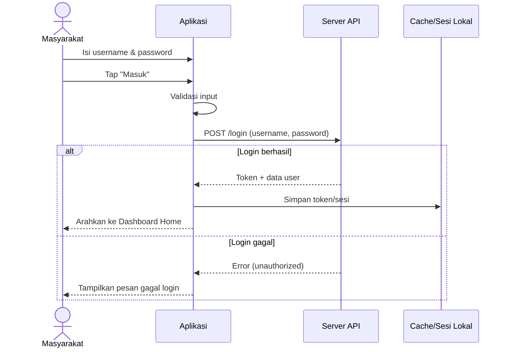
```mermaid
sequenceDiagram
    actor U as Masyarakat
    participant App as Aplikasi
    participant API as Server API
    participant Cache as Cache/Sesi Lokal

    U->>App: Isi username & password
    U->>App: Tap "Masuk"
    App->>App: Validasi input
    App->>API: POST /login (username, password)
    alt Login berhasil
        API-->>App: Token + data user
        App->>Cache: Simpan token/sesi
        App-->>U: Arahkan ke Dashboard Home
    else Login gagal
        API-->>App: Error (unauthorized)
        App-->>U: Tampilkan pesan gagal login
    end
```

---

## 3.2.4.2 Sequence Diagram Masyarakat Registrasi (UC-02)

Diagram ini menggambarkan proses pendaftaran akun baru oleh Masyarakat. Alur dimulai ketika pengguna membuka formulir registrasi, mengisi data identitas dan akun, lalu mengirim permintaan registrasi ke server. Sistem melakukan validasi isian, kemudian server membuat akun apabila data valid. Setelah akun berhasil dibuat, sistem menampilkan notifikasi sukses dan mengarahkan pengguna kembali ke halaman login. Jika data tidak valid atau server menolak permintaan, sistem menampilkan pesan kesalahan untuk diperbaiki.

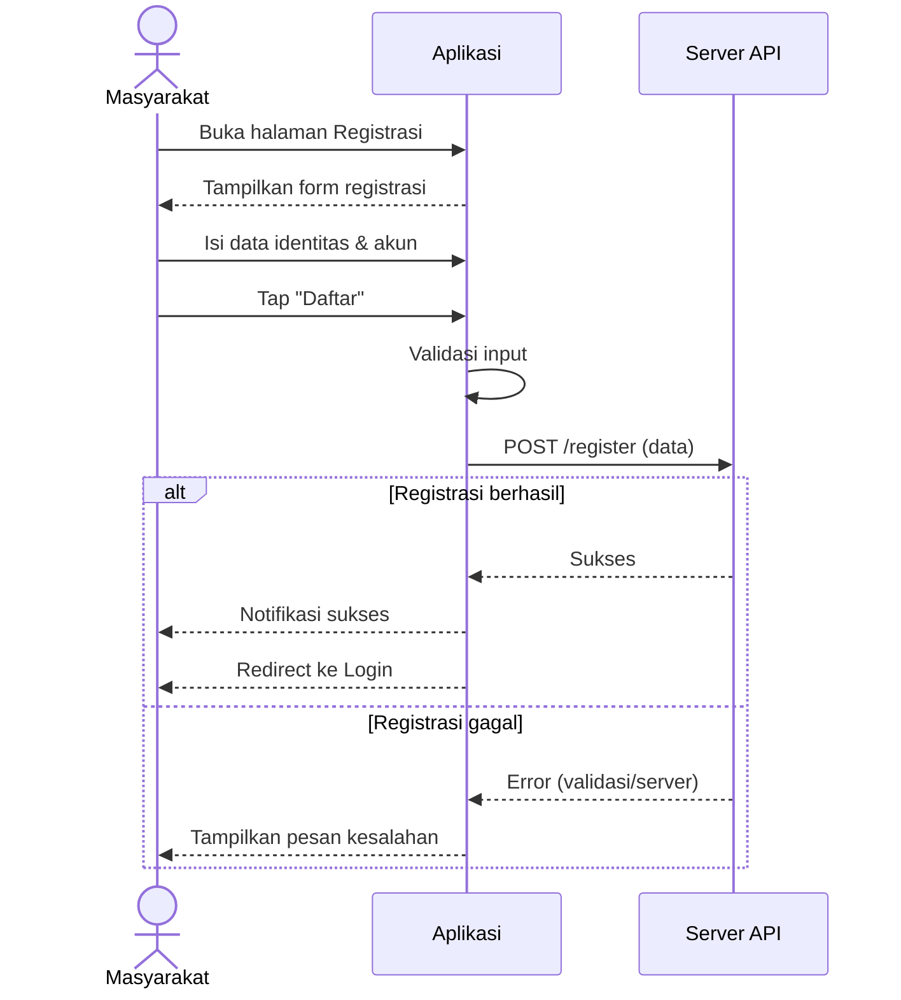
```mermaid
sequenceDiagram
    actor U as Masyarakat
    participant App as Aplikasi
    participant API as Server API

    U->>App: Buka halaman Registrasi
    App-->>U: Tampilkan form registrasi
    U->>App: Isi data identitas & akun
    U->>App: Tap "Daftar"
    App->>App: Validasi input
    App->>API: POST /register (data)
    alt Registrasi berhasil
        API-->>App: Sukses
        App-->>U: Notifikasi sukses
        App-->>U: Redirect ke Login
    else Registrasi gagal
        API-->>App: Error (validasi/server)
        App-->>U: Tampilkan pesan kesalahan
    end
```

---

## 3.2.4.3 Sequence Diagram Masyarakat Mengakses Dashboard Home (UC-03)

Diagram ini menggambarkan proses saat Masyarakat mengakses Dashboard Home setelah login. Alur dimulai ketika aplikasi membuka halaman home dan membaca token/sesi yang tersimpan. Sistem kemudian memuat ringkasan informasi yang tersedia (misalnya tagihan terbaru atau status permohonan) dan menampilkan menu utama. Pengguna dapat memilih salah satu menu untuk menuju ke fitur terkait. Jika sesi tidak valid, sistem mengarahkan pengguna kembali ke halaman login.

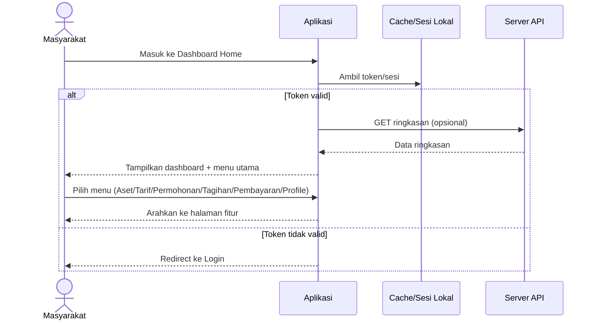
```mermaid
sequenceDiagram
    actor U as Masyarakat
    participant App as Aplikasi
    participant Cache as Cache/Sesi Lokal
    participant API as Server API

    U->>App: Masuk ke Dashboard Home
    App->>Cache: Ambil token/sesi
    alt Token valid
        App->>API: GET ringkasan (opsional)
        API-->>App: Data ringkasan
        App-->>U: Tampilkan dashboard + menu utama
        U->>App: Pilih menu (Aset/Tarif/Permohonan/Tagihan/Pembayaran/Profile)
        App-->>U: Arahkan ke halaman fitur
    else Token tidak valid
        App-->>U: Redirect ke Login
    end
```

---

## 3.2.4.4 Sequence Diagram Masyarakat Melihat Aset Retribusi (UC-04)

Diagram ini menggambarkan proses Masyarakat melihat daftar aset retribusi. Alur dimulai ketika pengguna membuka menu Aset Retribusi, lalu aplikasi meminta daftar aset ke server. Server mengembalikan data aset dan sistem menampilkannya dalam bentuk list. Pengguna dapat memilih salah satu aset untuk melihat detailnya. Jika terjadi kegagalan jaringan atau server, sistem menampilkan pesan error dan menyediakan opsi coba lagi.

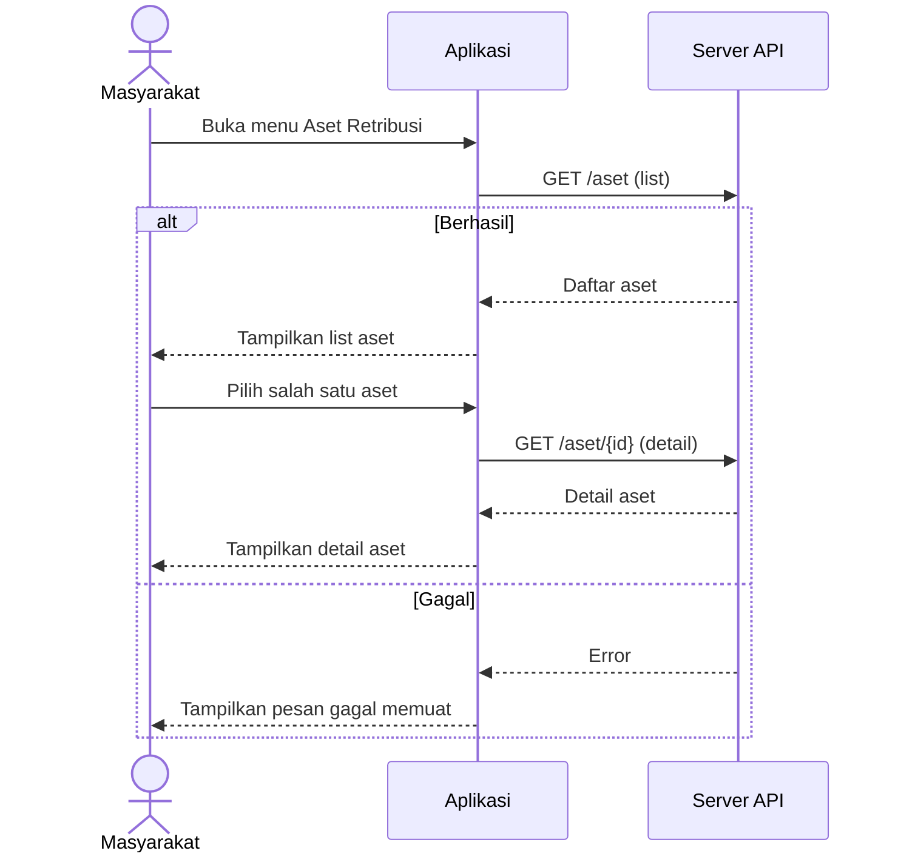
```mermaid
sequenceDiagram
    actor U as Masyarakat
    participant App as Aplikasi
    participant API as Server API

    U->>App: Buka menu Aset Retribusi
    App->>API: GET /aset (list)
    alt Berhasil
        API-->>App: Daftar aset
        App-->>U: Tampilkan list aset
        U->>App: Pilih salah satu aset
        App->>API: GET /aset/{id} (detail)
        API-->>App: Detail aset
        App-->>U: Tampilkan detail aset
    else Gagal
        API-->>App: Error
        App-->>U: Tampilkan pesan gagal memuat
    end
```

---

## 3.2.4.5 Sequence Diagram Masyarakat Melihat Tarif Sewa (UC-05)

Diagram ini menggambarkan proses Masyarakat melihat daftar tarif sewa. Alur dimulai ketika pengguna membuka menu Tarif Sewa, lalu aplikasi meminta data tarif dari server. Server mengembalikan daftar tarif dan sistem menampilkannya. Pengguna dapat memilih salah satu tarif untuk melihat detail, termasuk dokumen tarif jika tersedia. Jika dokumen tidak tersedia, sistem hanya menampilkan detail tarif.

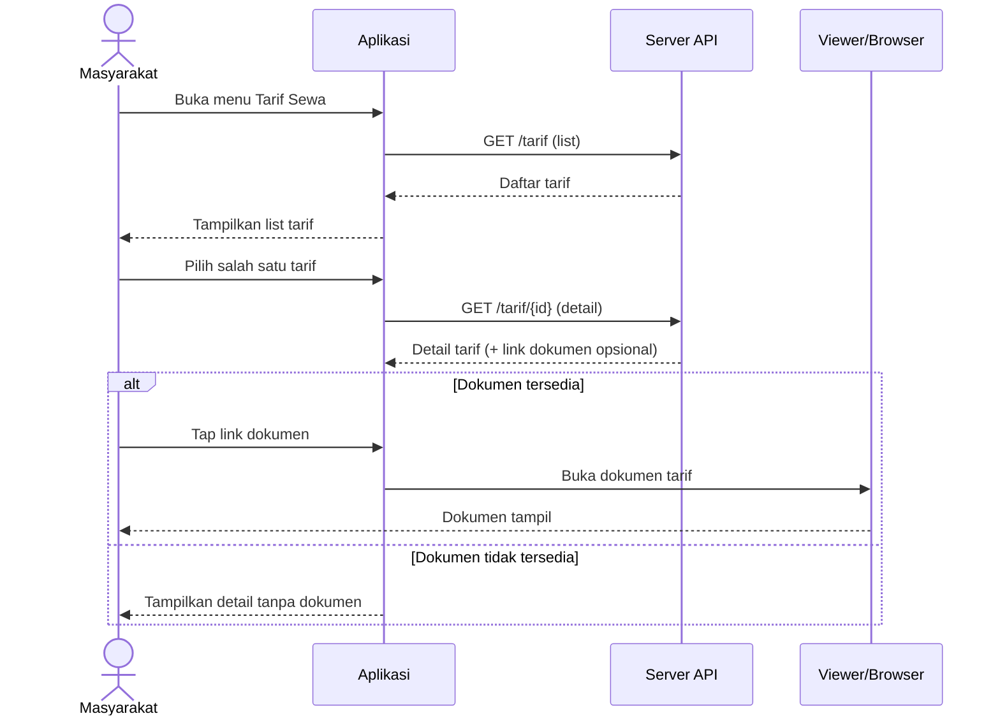
```mermaid
sequenceDiagram
    actor U as Masyarakat
    participant App as Aplikasi
    participant API as Server API
    participant Doc as Viewer/Browser

    U->>App: Buka menu Tarif Sewa
    App->>API: GET /tarif (list)
    API-->>App: Daftar tarif
    App-->>U: Tampilkan list tarif
    U->>App: Pilih salah satu tarif
    App->>API: GET /tarif/{id} (detail)
    API-->>App: Detail tarif (+ link dokumen opsional)
    alt Dokumen tersedia
        U->>App: Tap link dokumen
        App->>Doc: Buka dokumen tarif
        Doc-->>U: Dokumen tampil
    else Dokumen tidak tersedia
        App-->>U: Tampilkan detail tanpa dokumen
    end
```

---

## 3.2.4.6 Sequence Diagram Masyarakat Membuat Permohonan Sewa (UC-06)

Diagram ini menggambarkan proses pembuatan permohonan sewa oleh Masyarakat. Alur dimulai ketika pengguna membuka form permohonan, mengisi data (objek, durasi, keperluan) lalu memilih dokumen pendukung (misalnya KTP, domisili, dan surat). Sistem memvalidasi isian dan kelengkapan dokumen, kemudian mengirim permohonan ke server melalui mekanisme upload (multipart). Jika berhasil, server menyimpan permohonan dan sistem menampilkan notifikasi sukses. Jika gagal (dokumen tidak lengkap atau upload error), sistem menampilkan pesan kesalahan.

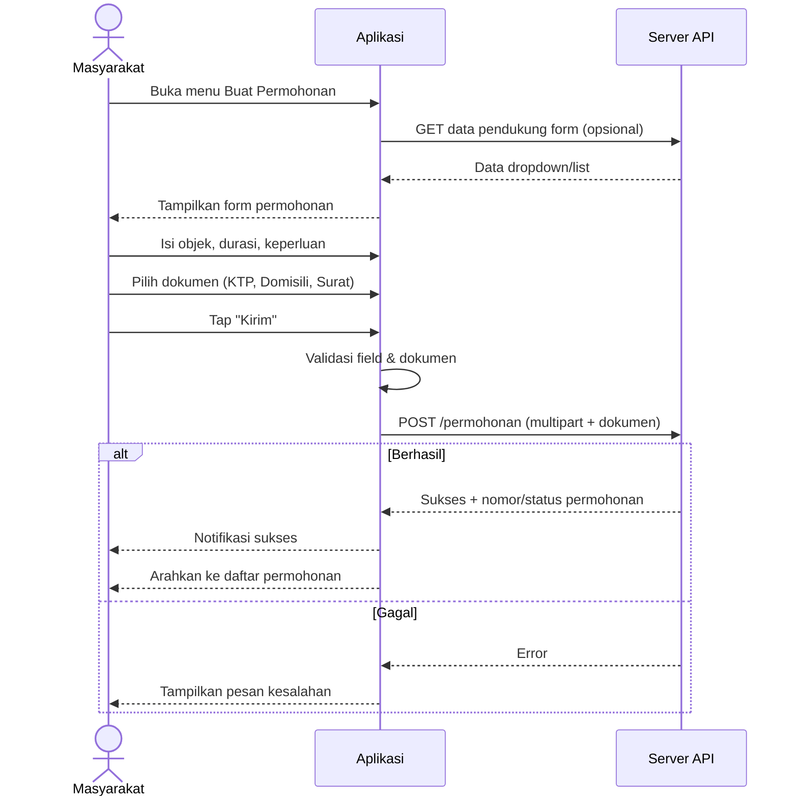
```mermaid
sequenceDiagram
    actor U as Masyarakat
    participant App as Aplikasi
    participant API as Server API

    U->>App: Buka menu Buat Permohonan
    App->>API: GET data pendukung form (opsional)
    API-->>App: Data dropdown/list
    App-->>U: Tampilkan form permohonan
    U->>App: Isi objek, durasi, keperluan
    U->>App: Pilih dokumen (KTP, Domisili, Surat)
    U->>App: Tap "Kirim"
    App->>App: Validasi field & dokumen
    App->>API: POST /permohonan (multipart + dokumen)
    alt Berhasil
        API-->>App: Sukses + nomor/status permohonan
        App-->>U: Notifikasi sukses
        App-->>U: Arahkan ke daftar permohonan
    else Gagal
        API-->>App: Error
        App-->>U: Tampilkan pesan kesalahan
    end
```

---

## 3.2.4.7 Sequence Diagram Masyarakat Melihat Daftar Permohonan (UC-07)

Diagram ini menggambarkan proses Masyarakat melihat daftar permohonan yang pernah dibuat. Alur dimulai saat pengguna membuka menu Permohonan, lalu aplikasi meminta daftar permohonan milik pengguna ke server. Server mengembalikan data permohonan dan sistem menampilkan list beserta status. Pengguna dapat memilih salah satu permohonan untuk melihat detailnya. Jika data kosong atau gagal dimuat, sistem menampilkan informasi yang sesuai.

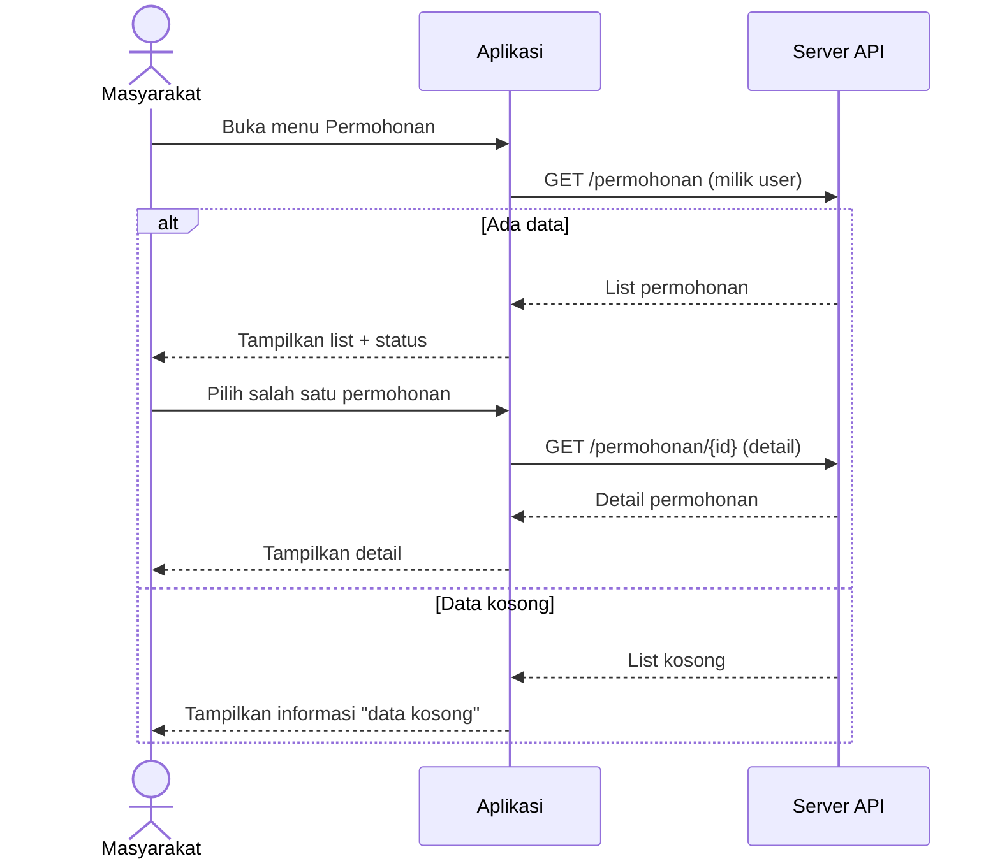
```mermaid
sequenceDiagram
    actor U as Masyarakat
    participant App as Aplikasi
    participant API as Server API

    U->>App: Buka menu Permohonan
    App->>API: GET /permohonan (milik user)
    alt Ada data
        API-->>App: List permohonan
        App-->>U: Tampilkan list + status
        U->>App: Pilih salah satu permohonan
        App->>API: GET /permohonan/{id} (detail)
        API-->>App: Detail permohonan
        App-->>U: Tampilkan detail
    else Data kosong
        API-->>App: List kosong
        App-->>U: Tampilkan informasi "data kosong"
    end
```

---

## 3.2.4.8 Sequence Diagram Masyarakat Melihat Perjanjian & Tagihan (UC-08)

Diagram ini menggambarkan proses Masyarakat melihat perjanjian aktif dan tagihan terkait. Alur dimulai ketika pengguna membuka menu Perjanjian atau Tagihan, lalu aplikasi meminta data perjanjian dan/atau tagihan ke server. Server mengembalikan data, sistem menampilkannya, dan pengguna dapat memilih item untuk melihat detail serta status pembayaran. Jika ada tagihan yang belum lunas, pengguna dapat melanjutkan ke proses pembayaran (UC-09).

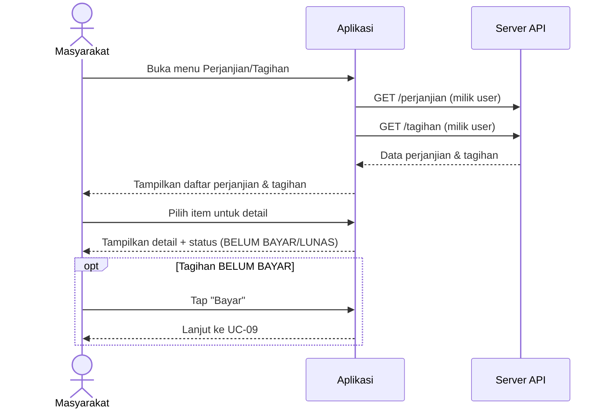
```mermaid
sequenceDiagram
    actor U as Masyarakat
    participant App as Aplikasi
    participant API as Server API

    U->>App: Buka menu Perjanjian/Tagihan
    App->>API: GET /perjanjian (milik user)
    App->>API: GET /tagihan (milik user)
    API-->>App: Data perjanjian & tagihan
    App-->>U: Tampilkan daftar perjanjian & tagihan
    U->>App: Pilih item untuk detail
    App-->>U: Tampilkan detail + status (BELUM BAYAR/LUNAS)
    opt Tagihan BELUM BAYAR
        U->>App: Tap "Bayar"
        App-->>U: Lanjut ke UC-09
    end
```

---

## 3.2.4.9 Sequence Diagram Masyarakat Membayar Tagihan via VA (UC-09)

Diagram ini menggambarkan proses pembayaran tagihan melalui Virtual Account secara otomatis. Alur dimulai ketika pengguna menekan tombol bayar pada tagihan, lalu sistem menyiapkan transaksi dan menampilkan nomor VA serta instruksi pembayaran. Pengguna melakukan pembayaran melalui kanal bank menggunakan nomor VA. Sistem kemudian menerima pembaruan status pembayaran melalui mekanisme yang tersedia (misalnya pengecekan status berkala atau notifikasi dari layanan pembayaran) hingga status berubah menjadi LUNAS. Jika pembayaran tidak dilakukan sampai batas waktu, transaksi dapat menjadi kedaluwarsa.

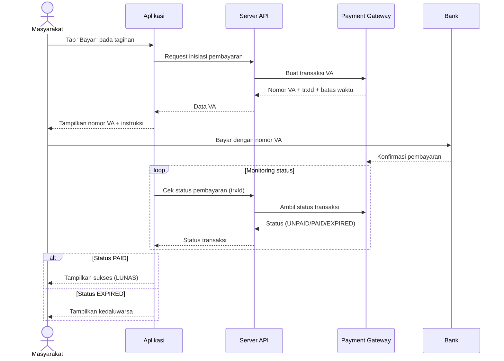
```mermaid
sequenceDiagram
    actor U as Masyarakat
    participant App as Aplikasi
    participant API as Server API
    participant PG as Payment Gateway
    participant Bank as Bank

    U->>App: Tap "Bayar" pada tagihan
    App->>API: Request inisiasi pembayaran
    API->>PG: Buat transaksi VA
    PG-->>API: Nomor VA + trxId + batas waktu
    API-->>App: Data VA
    App-->>U: Tampilkan nomor VA + instruksi

    U->>Bank: Bayar dengan nomor VA
    Bank-->>PG: Konfirmasi pembayaran
    loop Monitoring status
        App->>API: Cek status pembayaran (trxId)
        API->>PG: Ambil status transaksi
        PG-->>API: Status (UNPAID/PAID/EXPIRED)
        API-->>App: Status transaksi
    end

    alt Status PAID
        App-->>U: Tampilkan sukses (LUNAS)
    else Status EXPIRED
        App-->>U: Tampilkan kedaluwarsa
    end
```

---

## 3.2.4.10 Sequence Diagram Masyarakat Melihat Riwayat Pembayaran (UC-10)

Diagram ini menggambarkan proses Masyarakat melihat riwayat pembayaran yang sudah berhasil. Alur dimulai saat pengguna membuka menu Riwayat Pembayaran, lalu aplikasi meminta daftar transaksi pembayaran ke server. Server mengembalikan data transaksi (tanggal, nominal, status, referensi). Pengguna dapat memilih salah satu transaksi untuk melihat detail, termasuk bukti/struk jika sistem menyediakannya.

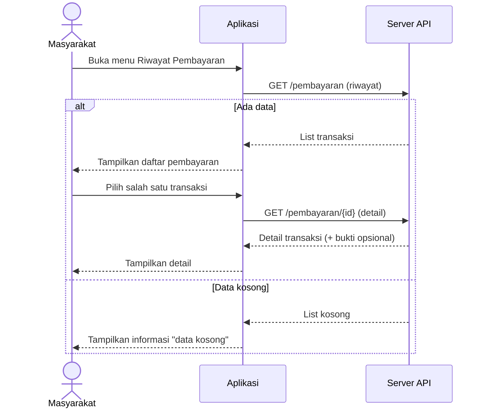
```mermaid
sequenceDiagram
    actor U as Masyarakat
    participant App as Aplikasi
    participant API as Server API

    U->>App: Buka menu Riwayat Pembayaran
    App->>API: GET /pembayaran (riwayat)
    alt Ada data
        API-->>App: List transaksi
        App-->>U: Tampilkan daftar pembayaran
        U->>App: Pilih salah satu transaksi
        App->>API: GET /pembayaran/{id} (detail)
        API-->>App: Detail transaksi (+ bukti opsional)
        App-->>U: Tampilkan detail
    else Data kosong
        API-->>App: List kosong
        App-->>U: Tampilkan informasi "data kosong"
    end
```

---

## 3.2.4.11 Sequence Diagram Masyarakat Profile & Logout (UC-11)

Diagram ini menggambarkan proses Masyarakat melihat profil dan melakukan logout. Alur dimulai ketika pengguna membuka menu Profile, lalu sistem memuat data profil yang tersedia dan menampilkannya. Jika fitur perubahan profil tersedia, pengguna dapat memperbarui data dan sistem menyimpan perubahan. Ketika pengguna memilih logout, sistem menghapus token/sesi dari penyimpanan lokal dan mengarahkan pengguna kembali ke halaman login.

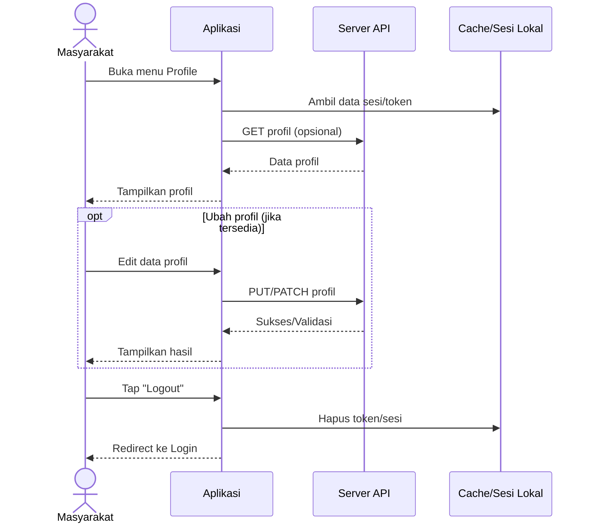
```mermaid
sequenceDiagram
    actor U as Masyarakat
    participant App as Aplikasi
    participant API as Server API
    participant Cache as Cache/Sesi Lokal

    U->>App: Buka menu Profile
    App->>Cache: Ambil data sesi/token
    App->>API: GET profil (opsional)
    API-->>App: Data profil
    App-->>U: Tampilkan profil

    opt Ubah profil (jika tersedia)
        U->>App: Edit data profil
        App->>API: PUT/PATCH profil
        API-->>App: Sukses/Validasi
        App-->>U: Tampilkan hasil
    end

    U->>App: Tap "Logout"
    App->>Cache: Hapus token/sesi
    App-->>U: Redirect ke Login
```

---

# Sequence Diagram — Petugas Lapangan (Admin)

## 3.2.4.12 Sequence Diagram Petugas Login Admin (UC-A1)

Diagram ini menggambarkan proses Petugas Lapangan melakukan login sebagai admin. Alur dimulai ketika petugas mengisi kredensial admin dan menekan tombol masuk. Sistem melakukan validasi dan jika berhasil, petugas diarahkan ke dashboard admin. Jika kredensial salah, sistem menampilkan pesan gagal login.

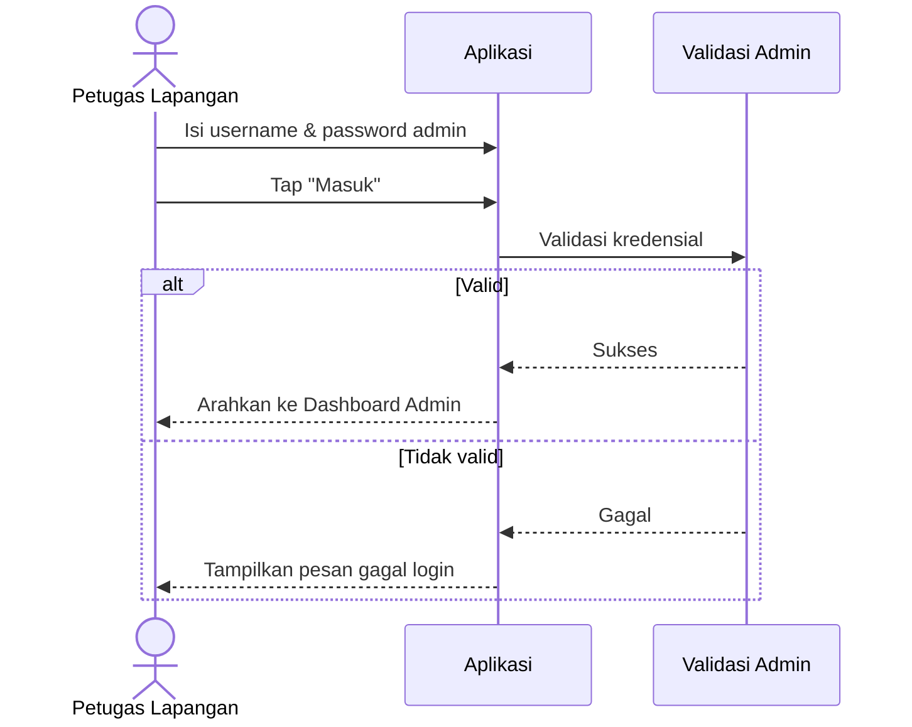
```mermaid
sequenceDiagram
    actor A as Petugas Lapangan
    participant App as Aplikasi
    participant Auth as Validasi Admin

    A->>App: Isi username & password admin
    A->>App: Tap "Masuk"
    App->>Auth: Validasi kredensial
    alt Valid
        Auth-->>App: Sukses
        App-->>A: Arahkan ke Dashboard Admin
    else Tidak valid
        Auth-->>App: Gagal
        App-->>A: Tampilkan pesan gagal login
    end
```

---

## 3.2.4.13 Sequence Diagram Petugas Dashboard Admin (UC-A2)

Diagram ini menggambarkan proses Petugas mengakses dashboard admin setelah login. Sistem menampilkan menu navigasi admin dan petugas dapat berpindah ke modul monitoring (permohonan, tagihan/perjanjian, pembayaran). Jika sesi habis, sistem mengarahkan petugas kembali ke login.

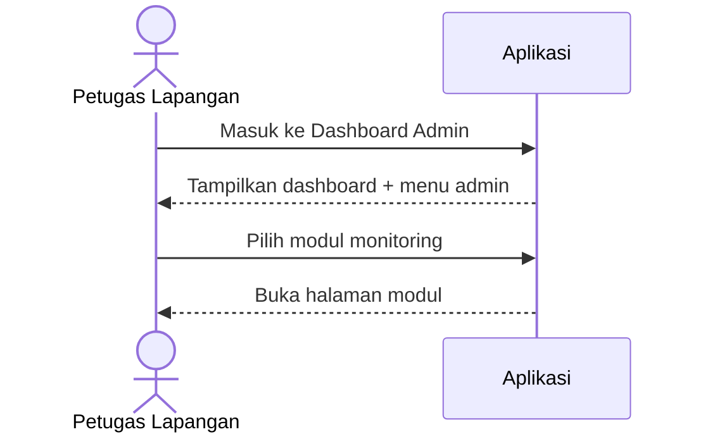
```mermaid
sequenceDiagram
    actor A as Petugas Lapangan
    participant App as Aplikasi

    A->>App: Masuk ke Dashboard Admin
    App-->>A: Tampilkan dashboard + menu admin
    A->>App: Pilih modul monitoring
    App-->>A: Buka halaman modul
```

---

## 3.2.4.14 Sequence Diagram Petugas Monitoring Permohonan (UC-A3)

Diagram ini menggambarkan proses Petugas memonitor daftar permohonan sewa. Petugas membuka modul permohonan, sistem memanggil data permohonan ke server dan menampilkannya. Petugas dapat memilih item untuk melihat detail bila tersedia.

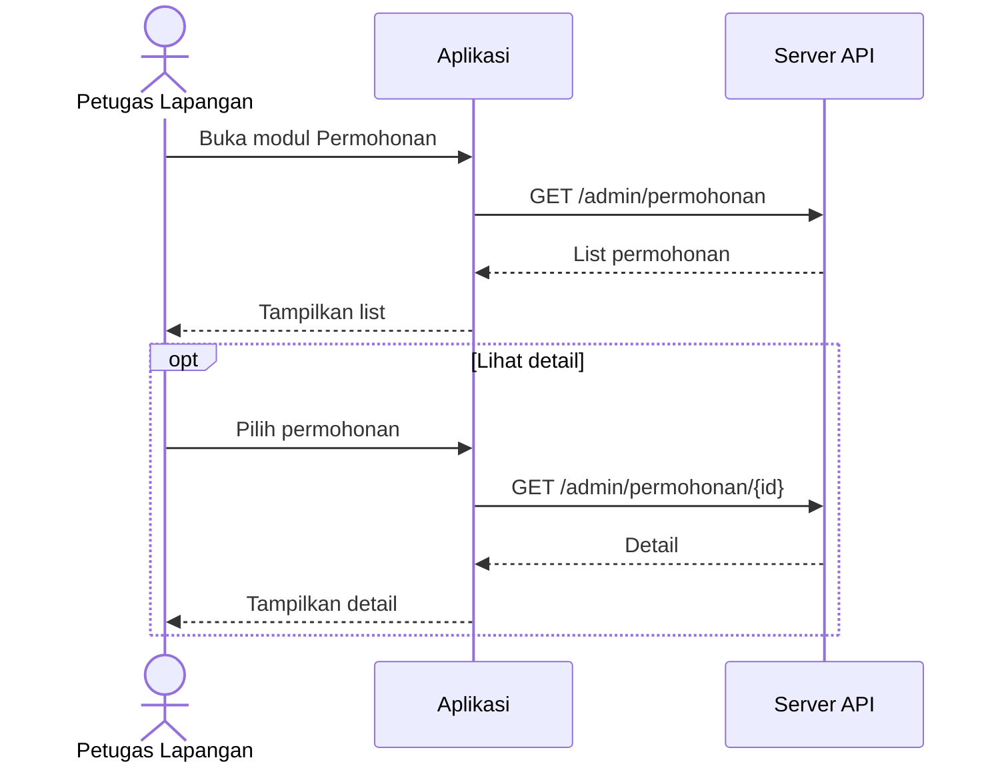
```mermaid
sequenceDiagram
    actor A as Petugas Lapangan
    participant App as Aplikasi
    participant API as Server API

    A->>App: Buka modul Permohonan
    App->>API: GET /admin/permohonan
    API-->>App: List permohonan
    App-->>A: Tampilkan list
    opt Lihat detail
        A->>App: Pilih permohonan
        App->>API: GET /admin/permohonan/{id}
        API-->>App: Detail
        App-->>A: Tampilkan detail
    end
```

---

## 3.2.4.15 Sequence Diagram Petugas Monitoring Perjanjian & Tagihan (UC-A4)

Diagram ini menggambarkan proses Petugas memonitor perjanjian dan tagihan. Petugas membuka modul terkait, sistem meminta data ke server, lalu menampilkan daftar beserta detail saat dipilih.

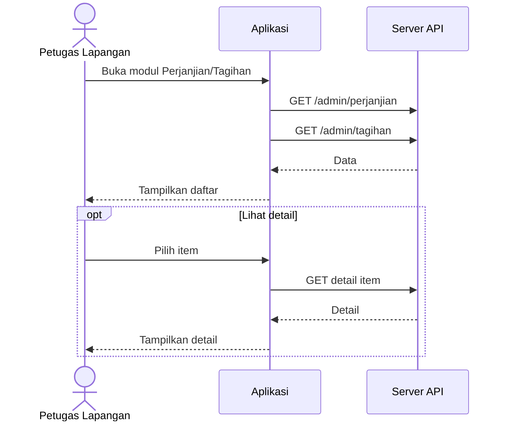
```mermaid
sequenceDiagram
    actor A as Petugas Lapangan
    participant App as Aplikasi
    participant API as Server API

    A->>App: Buka modul Perjanjian/Tagihan
    App->>API: GET /admin/perjanjian
    App->>API: GET /admin/tagihan
    API-->>App: Data
    App-->>A: Tampilkan daftar
    opt Lihat detail
        A->>App: Pilih item
        App->>API: GET detail item
        API-->>App: Detail
        App-->>A: Tampilkan detail
    end
```

---

## 3.2.4.16 Sequence Diagram Petugas Monitoring Pembayaran (UC-A5)

Diagram ini menggambarkan proses Petugas memonitor status pembayaran. Petugas membuka modul pembayaran, sistem memanggil daftar pembayaran dan status dari server, lalu menampilkan informasi pembayaran aktif maupun yang sudah selesai.

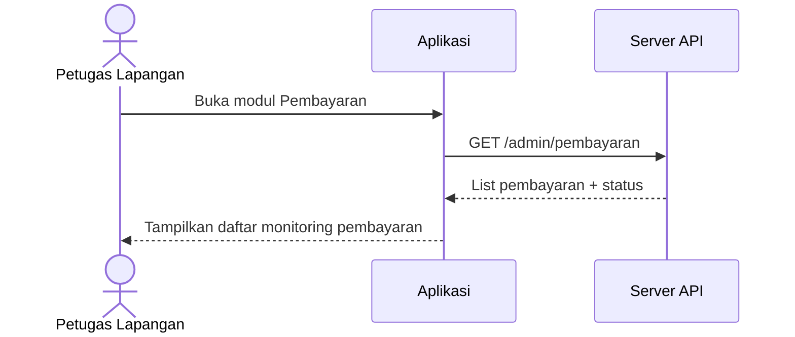
```mermaid
sequenceDiagram
    actor A as Petugas Lapangan
    participant App as Aplikasi
    participant API as Server API

    A->>App: Buka modul Pembayaran
    App->>API: GET /admin/pembayaran
    API-->>App: List pembayaran + status
    App-->>A: Tampilkan daftar monitoring pembayaran
```
