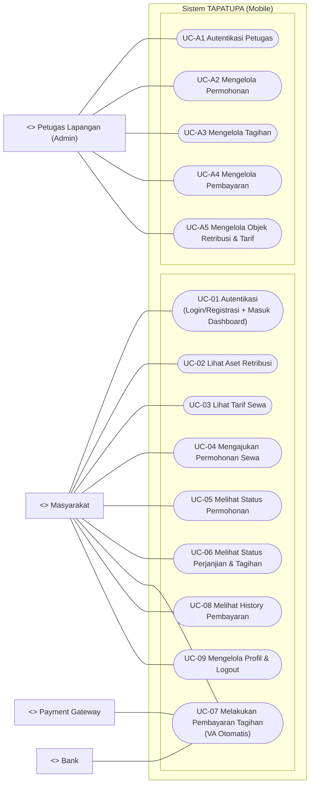

# Use Case Scenarios — TAPATUPA (berdasarkan struktur code)

> Cara melihat seperti **laporan (bukan source markdown)** di VS Code:
>
> - Buka file ini, lalu tekan **Ctrl+Shift+V** (Markdown: Open Preview).
> - Atau klik kanan tab file → **Open Preview to the Side**.
>
> (Opsional) Untuk dijadikan PDF: buka Preview → Print (atau pakai ekstensi “Markdown PDF”).

Dokumen ini merangkum use case scenario untuk 2 role:

- **Masyarakat (Pengguna)**
- **Petugas Lapangan (Admin)**

Format tabel mengikuti contoh yang kamu kirim.

## Use Case Diagram

---

## UC-01 — 🔐 Autentikasi

**Tabel 3.1. Use Case Scenario Masyarakat Autentikasi**

| Elemen               | Isi                                                                 |
| -------------------- | ------------------------------------------------------------------- |
| Use Case ID          | UC-01                                                               |
| Use Case Name        | Autentikasi                                                         |
| Use Case Description | Pengguna melakukan login atau registrasi untuk memperoleh token/sesi, lalu masuk ke dashboard home untuk mengakses fitur utama. |
| Primary Actor        | Masyarakat                                                          |
| Secondary Actor      | Sistem                                                              |
| Precondition         | 1. Pengguna membuka aplikasi (halaman autentikasi) 2. Koneksi internet tersedia  |
| Post Condition       | Token/sesi tersimpan dan dashboard home dapat diakses               |
| Related Use Case     | UC-02 s/d UC-09                                                     |

| Flow                     | User Action                                                   | System Response                                                                 |
| ------------------------ | ------------------------------------------------------------- | ------------------------------------------------------------------------------- |
| Primary Flow of Events   | 1. Pengguna memilih **Login**.                                | 2. Sistem menampilkan form login dan memvalidasi input.                         |
|                          | 3. Pengguna mengisi username & password lalu menekan “Masuk”.  | 4. Sistem mengirim permintaan login ke server.                                  |
|                          |                                                               | 5. Jika berhasil, sistem menerima token, menyimpan sesi, dan menampilkan dashboard home. |
| Alternate Flow of Events | Pengguna memilih **Registrasi**.                              | Sistem menampilkan form registrasi.                                             |
|                          | Pengguna mengisi data dan menekan “Daftar”.                   | Sistem mengirim permintaan registrasi. Jika sukses, sistem mengarahkan kembali ke login lalu masuk ke dashboard setelah login berhasil. |
| Error Flow of Events     | Kredensial salah / registrasi ditolak / validasi gagal.       | Sistem menampilkan pesan kesalahan dan meminta perbaikan input.                 |
|                          | Gangguan jaringan / server tidak merespon.                    | Sistem menampilkan pesan error dan menyediakan opsi coba lagi.                  |

---

## UC-02 — 🏢 Lihat Aset Retribusi

**Tabel 3.2. Use Case Scenario Masyarakat Melihat Aset Retribusi**

| Elemen               | Isi                                                                                 |
| -------------------- | ----------------------------------------------------------------------------------- |
| Use Case ID          | UC-02                                                                               |
| Use Case Name        | Melihat Aset Retribusi                                                              |
| Use Case Description | Mengambil daftar aset dari server dan menampilkan informasi (foto, nama, lokasi, status). |
| Primary Actor        | Masyarakat                                                                          |
| Secondary Actor      | Sistem                                                                              |
| Precondition         | Autentikasi (UC-01)                                                                 |
| Post Condition       | Daftar aset tampil                                                                  |
| Related Use Case     | UC-03, UC-04                                                                        |

| Flow                     | User Action                                   | System Response                                                        |
| ------------------------ | --------------------------------------------- | ---------------------------------------------------------------------- |
| Primary Flow of Events   | 1. Pengguna membuka menu Aset Retribusi.      | 2. Sistem memanggil API list aset dan menampilkan daftar.              |
|                          | 3. Pengguna memilih salah satu aset.          | 4. Sistem menampilkan detail aset (jika tersedia).                     |
| Error Flow of Events     | Gagal memuat data (network/server).           | Sistem menampilkan pesan gagal memuat dan opsi coba lagi.              |

---

## UC-03 — 💰 Lihat Tarif Sewa

**Tabel 3.3. Use Case Scenario Masyarakat Melihat Tarif Sewa**

| Elemen               | Isi                                                                 |
| -------------------- | ------------------------------------------------------------------- |
| Use Case ID          | UC-03                                                               |
| Use Case Name        | Melihat Tarif Sewa                                                  |
| Use Case Description | Mengambil daftar tarif dari server dan menampilkan harga per tipe/durasi. |
| Primary Actor        | Masyarakat                                                          |
| Secondary Actor      | Sistem                                                              |
| Precondition         | Autentikasi (UC-01)                                                 |
| Post Condition       | Daftar tarif tampil                                                  |
| Related Use Case     | UC-02, UC-04                                                        |

| Flow                     | User Action                             | System Response                                                   |
| ------------------------ | --------------------------------------- | --------------------------------------------------------------- |
| Primary Flow of Events   | 1. Pengguna membuka menu Tarif Sewa.    | 2. Sistem memanggil API tarif dan menampilkan daftar tarif.      |
|                          | 3. Pengguna memilih salah satu tarif.   | 4. Sistem menampilkan detail tarif dan dokumen (jika tersedia).  |
| Error Flow of Events     | Gagal memuat data tarif.                | Sistem menampilkan pesan error.                                  |

---

## UC-04 — 📋 Mengajukan Permohonan Sewa

**Tabel 3.4. Use Case Scenario Masyarakat Mengajukan Permohonan Sewa**

| Elemen               | Isi                                                                                                  |
| -------------------- | ---------------------------------------------------------------------------------------------------- |
| Use Case ID          | UC-04                                                                                                |
| Use Case Name        | Mengajukan Permohonan Sewa                                                                            |
| Use Case Description | Mengisi form (objek, durasi, keperluan) dan mengunggah dokumen pendukung (mis. KTP, domisili, surat), lalu mengirim ke server. |
| Primary Actor        | Masyarakat                                                                                           |
| Secondary Actor      | Sistem                                                                                               |
| Precondition         | Autentikasi (UC-01), aset dipilih/diketahui Dokumen pendukung tersedia (mis. KTP/domisili/surat)  |
| Post Condition       | Permohonan tercatat di sistem (mis. status awal BARU/menunggu proses) dan dapat dimonitor admin      |
| Related Use Case     | UC-05, UC-A3                                                                                         |

| Flow                     | User Action                                                     | System Response                                                                 |
| ------------------------ | --------------------------------------------------------------- | ------------------------------------------------------------------------------- |
| Primary Flow of Events   | 1. Pengguna membuka menu Buat Permohonan.                        | 2. Sistem menampilkan form dan memuat data pendukung (dropdown/list).           |
|                          | 3. Pengguna mengisi field dan memilih objek/durasi/keperluan.     | 4. Sistem memvalidasi input.                                                    |
|                          | 5. Pengguna memilih & mengunggah dokumen pendukung.               | 6. Sistem menyiapkan upload dan memvalidasi kelengkapan dokumen.                |
|                          | 7. Pengguna menekan “Kirim”.                                      | 8. Sistem mengirim permohonan (multipart) ke server dan menampilkan hasil.      |
| Error Flow of Events     | Dokumen/field tidak lengkap atau upload gagal.                    | Sistem menampilkan pesan kesalahan dan permohonan tidak tersimpan.              |

---

## UC-05 — 📌 Melihat Status Permohonan

**Tabel 3.5. Use Case Scenario Masyarakat Melihat Status Permohonan**

| Elemen               | Isi                                                                 |
| -------------------- | ------------------------------------------------------------------- |
| Use Case ID          | UC-05                                                               |
| Use Case Name        | Melihat Status Permohonan                                           |
| Use Case Description | Mengambil daftar permohonan milik user dan menampilkan status permohonan. |
| Primary Actor        | Masyarakat                                                          |
| Secondary Actor      | Sistem                                                              |
| Precondition         | Permohonan sudah dibuat (UC-04)                                     |
| Post Condition       | List permohonan tampil                                              |
| Related Use Case     | UC-06                                                               |

| Flow                     | User Action                                  | System Response                                                       |
| ------------------------ | -------------------------------------------- | --------------------------------------------------------------------- |
| Primary Flow of Events   | 1. Pengguna membuka menu Permohonan.         | 2. Sistem memanggil API daftar permohonan dan menampilkan list + status. |
|                          | 3. Pengguna memilih salah satu permohonan.   | 4. Sistem menampilkan detail permohonan (jika tersedia).               |
| Error Flow of Events     | Gagal memuat daftar.                         | Sistem menampilkan pesan error.                                        |

---

## UC-06 — 📜 Melihat Status Perjanjian & Tagihan

**Tabel 3.6. Use Case Scenario Masyarakat Melihat Status Perjanjian dan Tagihan**

| Elemen               | Isi                                                                 |
| -------------------- | ------------------------------------------------------------------- |
| Use Case ID          | UC-06                                                               |
| Use Case Name        | Melihat Status Perjanjian & Tagihan                                 |
| Use Case Description | Melihat perjanjian aktif dan tagihan terkait, termasuk akses detail dan tombol bayar. |
| Primary Actor        | Masyarakat                                                          |
| Secondary Actor      | Sistem                                                              |
| Precondition         | Perjanjian/tagihan tersedia di akun pengguna                        |
| Post Condition       | Daftar perjanjian & tagihan tampil                                  |
| Related Use Case     | UC-07, UC-08, UC-A4                                                 |

| Flow                     | User Action                                      | System Response                                                           |
| ------------------------ | ------------------------------------------------ | ------------------------------------------------------------------------- |
| Primary Flow of Events   | 1. Pengguna membuka menu Perjanjian/Tagihan.     | 2. Sistem memanggil API perjanjian & tagihan dan menampilkan daftar.      |
|                          | 3. Pengguna memilih item untuk melihat detail.   | 4. Sistem menampilkan detail dan status (mis. BELUM BAYAR/LUNAS).         |
| Alternate Flow of Events | Tidak ada data perjanjian/tagihan.               | Sistem menampilkan informasi data kosong.                                 |
| Error Flow of Events     | Gagal memuat data.                               | Sistem menampilkan pesan error.                                           |

---

## UC-07 — 💳 Melakukan Pembayaran Tagihan (VA Otomatis)

**Tabel 3.7. Use Case Scenario Masyarakat Membayar Tagihan via VA**

| Elemen               | Isi                                                                 |
| -------------------- | ------------------------------------------------------------------- |
| Use Case ID          | UC-07                                                               |
| Use Case Name        | Melakukan Pembayaran Tagihan (Virtual Account)                      |
| Use Case Description | Pengguna memilih tagihan dan melakukan pembayaran menggunakan nomor Virtual Account, lalu status diperbarui otomatis oleh sistem. |
| Primary Actor        | Masyarakat                                                          |
| Secondary Actor      | Sistem, Payment Gateway, Bank                                       |
| Precondition         | Tagihan status BELUM BAYAR                                          |
| Post Condition       | Status pembayaran menjadi LUNAS/berhasil (jika pembayaran sukses) dan bukti pembayaran tersedia (jika disediakan sistem) |
| Related Use Case     | UC-08, UC-A5                                                        |

| Flow                     | User Action                                                              | System Response                                                                 |
| ------------------------ | ------------------------------------------------------------------------ | ------------------------------------------------------------------------------- |
| Primary Flow of Events   | 1. Pengguna menekan tombol “Bayar” pada tagihan.                         | 2. Sistem menyiapkan transaksi pembayaran dan menampilkan nomor VA & instruksi. |
|                          | 3. Pengguna melakukan transfer/pembayaran melalui kanal bank menggunakan nomor VA. | 4. Sistem memonitor status pembayaran (mis. melalui pengecekan status berkala). |
|                          |                                                                          | 5. Jika pembayaran terkonfirmasi, sistem memperbarui status tagihan menjadi LUNAS dan menampilkan/memperbarui bukti pembayaran (jika tersedia). |
| Alternate Flow of Events | Pengguna tidak jadi membayar sampai batas waktu.                         | Sistem menandai transaksi expired (jika ada batas waktu).                       |
| Error Flow of Events     | Gagal menyiapkan transaksi / gagal cek status.                            | Sistem menampilkan pesan error dan menyediakan opsi coba lagi.                  |

---

## UC-08 — 🧾 Melihat History Pembayaran

**Tabel 3.8. Use Case Scenario Masyarakat Melihat History Pembayaran**

| Elemen               | Isi                                                                 |
| -------------------- | ------------------------------------------------------------------- |
| Use Case ID          | UC-08                                                               |
| Use Case Name        | Melihat History Pembayaran                                           |
| Use Case Description | Menampilkan daftar pembayaran yang sudah berhasil/lunas dan detail transaksi. |
| Primary Actor        | Masyarakat                                                          |
| Secondary Actor      | Sistem                                                              |
| Precondition         | Minimal satu pembayaran berhasil/lunas (UC-07)                       |
| Post Condition       | List pembayaran tampil                                               |
| Related Use Case     | -                                                                   |

| Flow                     | User Action                                  | System Response                                                      |
| ------------------------ | -------------------------------------------- | -------------------------------------------------------------------- |
| Primary Flow of Events   | 1. Pengguna membuka menu History Pembayaran. | 2. Sistem memanggil API riwayat pembayaran dan menampilkan daftar.   |
|                          | 3. Pengguna memilih salah satu item.         | 4. Sistem menampilkan detail pembayaran (ref, tanggal, nominal, dll). |
| Alternate Flow of Events | Tidak ada history pembayaran.                | Sistem menampilkan informasi data kosong.                             |
| Error Flow of Events     | Gagal memuat data.                           | Sistem menampilkan pesan error.                                       |

---

## UC-09 — 👤 Mengelola Profil & Logout

**Tabel 3.9. Use Case Scenario Masyarakat Mengelola Profil dan Logout**

| Elemen               | Isi                                                                 |
| -------------------- | ------------------------------------------------------------------- |
| Use Case ID          | UC-09                                                               |
| Use Case Name        | Mengelola Profil & Logout                                           |
| Use Case Description | Melihat informasi profil yang tersedia, (opsional) memperbarui profil jika disediakan, dan logout (hapus sesi). |
| Primary Actor        | Masyarakat                                                          |
| Secondary Actor      | Sistem                                                              |
| Precondition         | Autentikasi (UC-01)                                                 |
| Post Condition       | Session clear dan redirect ke login (jika logout)                   |
| Related Use Case     | UC-01                                                               |

| Flow                     | User Action                          | System Response                                                     |
| ------------------------ | ------------------------------------ | ------------------------------------------------------------------- |
| Primary Flow of Events   | 1. Pengguna membuka menu Profile.    | 2. Sistem menampilkan data profil yang tersedia.                    |
|                          | 3. Pengguna menekan tombol “Logout”. | 4. Sistem menghapus sesi lokal dan mengarahkan pengguna ke login.   |
| Alternate Flow of Events | Pengguna mengubah data profil (jika fitur tersedia). | Sistem menyimpan perubahan dan menampilkan hasil/peringatan validasi. |
|                          | Pengguna kembali tanpa logout.       | Sistem kembali ke halaman sebelumnya.                               |
| Error Flow of Events     | Gagal memuat sebagian data profil.   | Sistem tetap tampilkan data yang ada dan menandai field yang kosong. |

---

# Use Case Scenarios — Petugas Lapangan (Admin)

## UC-A1 — Autentikasi Petugas

**Tabel 3.10. Use Case Scenario Petugas Autentikasi**

| Elemen               | Isi                                                                                                      |
| -------------------- | -------------------------------------------------------------------------------------------------------- |
| Use Case ID          | UC-A1                                                                                                    |
| Use Case Name        | Autentikasi Petugas                                                                                      |
| Use Case Description | Petugas melakukan login untuk mengakses modul admin (permohonan, tagihan, pembayaran, dan data objek/tarif). |
| Primary Actor        | Petugas Lapangan                                                                                         |
| Secondary Actor      | Sistem                                                                                                   |
| Precondition         | 1. Petugas berada di halaman login 2. Kredensial admin tersedia                                       |

| Flow                     | User Action                                     | System Response                                                    |
| ------------------------ | ----------------------------------------------- | ------------------------------------------------------------------ |
| Primary Flow of Events   | 1. Petugas mengisi username dan password admin. | 2. Sistem memvalidasi kredensial admin.                            |
|                          | 3. Petugas menekan tombol “Masuk”.              | 4. Sistem menyimpan sesi admin dan mengarahkan ke dashboard admin. |
| Alternate Flow of Events | Petugas memilih login sebagai user biasa.       | Sistem mengikuti alur login user.                                  |
| Error Flow of Events     | Kredensial admin salah.                         | Sistem menampilkan pesan gagal login.                              |
| Post Condition           |                                                 | Petugas berada di dashboard admin.                                 |

---

## UC-A2 — Mengelola Permohonan

**Tabel 3.11. Use Case Scenario Petugas Mengelola Permohonan**

| Elemen               | Isi                                                                                                                           |
| -------------------- | ----------------------------------------------------------------------------------------------------------------------------- |
| Use Case ID          | UC-A2                                                                                                                         |
| Use Case Name        | Mengelola Permohonan                                                                                                          |
| Use Case Description | Petugas melihat daftar permohonan sewa, memeriksa detail, dan melakukan tindak lanjut sesuai prosedur (mis. verifikasi/monitoring). |
| Primary Actor        | Petugas Lapangan                                                                                                              |
| Secondary Actor      | Sistem                                                                                                                        |
| Precondition         | 1. Petugas sudah autentikasi (UC-A1)                                                                                          |

| Flow                     | User Action                                              | System Response                                        |
| ------------------------ | -------------------------------------------------------- | ------------------------------------------------------ |
| Primary Flow of Events   | 1. Petugas membuka modul Permohonan.                     | 2. Sistem memanggil API dan menampilkan daftar permohonan. |
|                          | 3. Petugas memilih salah satu permohonan.                | 4. Sistem menampilkan detail permohonan (jika tersedia). |
| Alternate Flow of Events | Petugas kembali ke menu sebelumnya.                      | Sistem menampilkan halaman sebelumnya.                 |
| Error Flow of Events     | Sesi admin habis/unauthorized.                           | Sistem mengarahkan petugas ke login.                   |
| Post Condition           |                                                          | Petugas berada pada modul admin yang dipilih.          |

---

## UC-A3 — Mengelola Tagihan

**Tabel 3.12. Use Case Scenario Petugas Mengelola Tagihan**

| Elemen               | Isi                                                                               |
| -------------------- | --------------------------------------------------------------------------------- |
| Use Case ID          | UC-A3                                                                             |
| Use Case Name        | Mengelola Tagihan                                                                 |
| Use Case Description | Petugas melihat daftar tagihan terkait sewa/perjanjian untuk monitoring dan memastikan statusnya sesuai. |
| Primary Actor        | Petugas Lapangan                                                                  |
| Secondary Actor      | Sistem                                                                            |
| Precondition         | 1. Petugas sudah autentikasi (UC-A1) 2. Koneksi internet tersedia              |

| Flow                     | User Action                               | System Response                                                              |
| ------------------------ | ----------------------------------------- | ---------------------------------------------------------------------------- |
| Primary Flow of Events   | 1. Petugas membuka modul Tagihan.         | 2. Sistem memanggil API dan menampilkan daftar tagihan.                      |
|                          | 3. Petugas memilih salah satu tagihan.    | 4. Sistem menampilkan detail tagihan/perjanjian terkait (jika tersedia).      |
| Alternate Flow of Events | Tidak ada data tagihan.                   | Sistem menampilkan data kosong.                                              |
| Error Flow of Events     | Gagal memuat data.                        | Sistem menampilkan pesan error.                                              |
| Post Condition           |                                           | Daftar tagihan tampil untuk monitoring.                                      |

---

## UC-A4 — Mengelola Pembayaran

**Tabel 3.13. Use Case Scenario Petugas Mengelola Pembayaran**

| Elemen               | Isi                                                                                                            |
| -------------------- | -------------------------------------------------------------------------------------------------------------- |
| Use Case ID          | UC-A4                                                                                                          |
| Use Case Name        | Mengelola Pembayaran                                                                                           |
| Use Case Description | Petugas memonitor daftar pembayaran dan statusnya, serta melihat detail transaksi pembayaran jika tersedia.    |
| Primary Actor        | Petugas Lapangan                                                                                               |
| Secondary Actor      | Sistem                                                                                                         |
| Precondition         | 1. Petugas sudah autentikasi (UC-A1) 2. Koneksi internet tersedia                                           |

| Flow                     | User Action                                       | System Response                                      |
| ------------------------ | ------------------------------------------------- | ---------------------------------------------------- |
| Primary Flow of Events   | 1. Petugas membuka modul Pembayaran.              | 2. Sistem memanggil API pembayaran dan menampilkan daftar status pembayaran. |
|                          | 3. Petugas memilih salah satu transaksi.          | 4. Sistem menampilkan detail pembayaran.                                      |
| Alternate Flow of Events | Data kosong.                                      | Sistem menampilkan data kosong.                      |
| Error Flow of Events     | Gagal memuat data.                                | Sistem menampilkan pesan error.                      |
| Post Condition           |                                                   | Informasi pembayaran tampil untuk monitoring.        |

---

## UC-A5 — Mengelola Objek Retribusi & Tarif

**Tabel 3.14. Use Case Scenario Petugas Mengelola Objek Retribusi dan Tarif**

| Elemen               | Isi                                                                                                      |
| -------------------- | -------------------------------------------------------------------------------------------------------- |
| Use Case ID          | UC-A5                                                                                                    |
| Use Case Name        | Mengelola Objek Retribusi & Tarif                                                                        |
| Use Case Description | Petugas mengakses data objek retribusi dan tarif (mis. melihat daftar dan detail) untuk kebutuhan monitoring lapangan. |
| Primary Actor        | Petugas Lapangan                                                                                         |
| Secondary Actor      | Sistem                                                                                                   |
| Precondition         | 1. Petugas sudah autentikasi (UC-A1) 2. Koneksi internet tersedia                                     |

| Flow                     | User Action                                   | System Response                                                              |
| ------------------------ | --------------------------------------------- | ---------------------------------------------------------------------------- |
| Primary Flow of Events   | 1. Petugas membuka menu Objek Retribusi/Tarif Objek. | 2. Sistem menampilkan daftar data.                                      |
|                          | 3. Petugas memilih item untuk melihat detail.         | 4. Sistem menampilkan detail objek/tarif (jika tersedia).               |
| Alternate Flow of Events | Tidak ada data objek/tarif.                   | Sistem menampilkan data kosong.                                              |
| Error Flow of Events     | Gagal memuat data objek/tarif.                | Sistem menampilkan pesan error.                                              |
| Post Condition           |                                               | Data objek retribusi dan tarif tampil untuk monitoring.                      |
