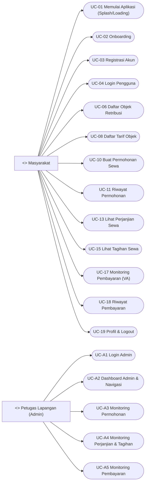

# Use Case Scenarios — TAPATUPA (berdasarkan struktur code)

> Cara melihat seperti **laporan (bukan source markdown)** di VS Code:
>
> - Buka file ini, lalu tekan **Ctrl+Shift+V** (Markdown: Open Preview).
> - Atau klik kanan tab file → **Open Preview to the Side**.
>
> (Opsional) Untuk dijadikan PDF: buka Preview → Print (atau pakai ekstensi “Markdown PDF”).

Dokumen ini merangkum use case scenario untuk 2 role:

- **Masyarakat (Pengguna)**
- **Petugas Lapangan (Admin)**

Format tabel mengikuti contoh yang kamu kirim.

## Use Case Diagram

---

## UC-01 — Splash/Loading & Navigasi Awal

**Tabel 3.1. Use Case Scenario Masyarakat Memulai Aplikasi**

| Elemen               | Isi                                                                                                                                      |
| -------------------- | ---------------------------------------------------------------------------------------------------------------------------------------- |
| Use Case ID          | UC-01                                                                                                                                    |
| Use Case Name        | Memulai Aplikasi (Splash/Loading)                                                                                                        |
| Use Case Description | Use case ini menjelaskan proses awal saat aplikasi dibuka sampai sistem mengarahkan pengguna ke onboarding atau home (jika sudah login). |
| Primary Actor        | Masyarakat                                                                                                                               |
| Secondary Actor      | Sistem                                                                                                                                   |
| Precondition         | 1. Pengguna membuka aplikasi 2. Aplikasi terpasang di perangkat                                                                       |

| Flow                     | User Action                                        | System Response                                                                                      |
| ------------------------ | -------------------------------------------------- | ---------------------------------------------------------------------------------------------------- |
| Primary Flow of Events   | 1. Pengguna membuka aplikasi.                      | 2. Sistem menampilkan splash/loading dan logo.                                                       |
|                          | 3. Pengguna menunggu proses selesai.               | 4. Sistem mengecek status login tersimpan.                                                           |
|                          |                                                    | 5. Jika belum login, sistem mengarahkan ke onboarding. Jika sudah login, sistem mengarahkan ke home. |
| Alternate Flow of Events | Pengguna menutup aplikasi sebelum loading selesai. | Sistem menghentikan proses karena aplikasi ditutup.                                                  |
| Error Flow of Events     | Terjadi error saat membaca status login lokal.     | Sistem mengarahkan pengguna ke onboarding/login.                                                     |
| Post Condition           |                                                    | Pengguna berada di onboarding atau home.                                                             |

---

## UC-02 — Onboarding

**Tabel 3.2. Use Case Scenario Masyarakat Melihat Onboarding**

| Elemen               | Isi                                                                                                               |
| -------------------- | ----------------------------------------------------------------------------------------------------------------- |
| Use Case ID          | UC-02                                                                                                             |
| Use Case Name        | Melihat Onboarding                                                                                                |
| Use Case Description | Use case ini menjelaskan alur onboarding berupa beberapa slide informasi sebelum pengguna masuk ke halaman login. |
| Primary Actor        | Masyarakat                                                                                                        |
| Secondary Actor      | Sistem                                                                                                            |
| Precondition         | 1. Pengguna berada di onboarding 2. Aplikasi berhasil memuat asset slide                                       |

| Flow                     | User Action                                                     | System Response                                                               |
| ------------------------ | --------------------------------------------------------------- | ----------------------------------------------------------------------------- |
| Primary Flow of Events   | 1. Pengguna melihat slide onboarding.                           | 2. Sistem menampilkan slide (gambar, judul, deskripsi).                       |
|                          | 3. Pengguna menekan tombol “Selanjutnya” sampai slide terakhir. | 4. Sistem berpindah slide dan memperbarui indikator.                          |
|                          | 5. Pada slide terakhir, pengguna menekan “Mulai”.               | 6. Sistem mengarahkan pengguna ke halaman login.                              |
| Alternate Flow of Events | Pengguna menekan “Lewati”.                                      | Sistem langsung mengarahkan ke login tanpa menyelesaikan semua slide.         |
| Error Flow of Events     | Asset gambar slide gagal dimuat.                                | Sistem menampilkan placeholder (ikon) dan onboarding tetap dapat dilanjutkan. |
| Post Condition           |                                                                 | Pengguna berada di halaman login.                                             |

---

## UC-03 — Registrasi

**Tabel 3.3. Use Case Scenario Masyarakat Melakukan Registrasi**

| Elemen               | Isi                                                                                              |
| -------------------- | ------------------------------------------------------------------------------------------------ |
| Use Case ID          | UC-03                                                                                            |
| Use Case Name        | Registrasi Akun                                                                                  |
| Use Case Description | Use case ini menjelaskan proses pendaftaran akun baru melalui form registrasi dan validasi data. |
| Primary Actor        | Masyarakat                                                                                       |
| Secondary Actor      | Sistem                                                                                           |
| Precondition         | 1. Pengguna berada di halaman registrasi 2. Koneksi internet tersedia                         |

| Flow                     | User Action                                                                  | System Response                                                                    |
| ------------------------ | ---------------------------------------------------------------------------- | ---------------------------------------------------------------------------------- |
| Primary Flow of Events   | 1. Pengguna mengisi NIK, email, username, password, dan konfirmasi password. | 2. Sistem menampilkan form registrasi dan menerima input.                          |
|                          | 3. Pengguna menekan tombol daftar/registrasi.                                | 4. Sistem memvalidasi: field wajib, NIK 16 digit, format email, dan password sama. |
|                          |                                                                              | 5. Sistem mengirim permintaan registrasi ke server.                                |
|                          |                                                                              | 6. Sistem menampilkan notifikasi sukses dan mengarahkan pengguna ke login.         |
| Alternate Flow of Events | Pengguna membatalkan dan kembali ke login.                                   | Sistem kembali ke halaman login.                                                   |
| Error Flow of Events     | Data input tidak valid (NIK/email/password).                                 | Sistem menampilkan pesan kesalahan dan meminta pengguna memperbaiki input.         |
|                          | Server mengembalikan gagal registrasi.                                       | Sistem menampilkan pesan gagal dari server.                                        |
| Post Condition           |                                                                              | Akun terdaftar (jika sukses) dan pengguna dapat login.                             |

---

## UC-04 — Login (Masyarakat)

**Tabel 3.4. Use Case Scenario Masyarakat Melakukan Login**

| Elemen               | Isi                                                                                                           |
| -------------------- | ------------------------------------------------------------------------------------------------------------- |
| Use Case ID          | UC-04                                                                                                         |
| Use Case Name        | Login Pengguna                                                                                                |
| Use Case Description | Use case ini menjelaskan proses autentikasi pengguna menggunakan username dan password hingga sesi tersimpan. |
| Primary Actor        | Masyarakat                                                                                                    |
| Secondary Actor      | Sistem                                                                                                        |
| Precondition         | 1. Pengguna berada di halaman login 2. Pengguna memiliki akun terdaftar 3. Koneksi internet tersedia    |

| Flow                     | User Action                                          | System Response                                                                          |
| ------------------------ | ---------------------------------------------------- | ---------------------------------------------------------------------------------------- |
| Primary Flow of Events   | 1. Pengguna mengisi username dan password.           | 2. Sistem menampilkan form login dan menerima input.                                     |
|                          | 3. Pengguna menekan tombol “Masuk”.                  | 4. Sistem memvalidasi field tidak kosong.                                                |
|                          |                                                      | 5. Sistem mengirim permintaan login ke server.                                           |
|                          |                                                      | 6. Jika sukses, sistem menyimpan token/sesi (SharedPreferences) dan mengarahkan ke home. |
| Alternate Flow of Events | Pengguna menekan tombol “Daftar” dari halaman login. | Sistem mengarahkan pengguna ke registrasi.                                               |
| Error Flow of Events     | Username/password kosong.                            | Sistem menampilkan pesan kesalahan.                                                      |
|                          | Username/password salah atau server menolak.         | Sistem menampilkan pesan gagal login.                                                    |
|                          | Token tidak tersimpan/bermasalah.                    | Sistem meminta login ulang atau kembali ke login.                                        |
| Post Condition           |                                                      | Pengguna berhasil masuk ke home (jika sukses).                                           |

---

## UC-06 — Daftar Objek Retribusi (Katalog Aset)

**Tabel 3.5. Use Case Scenario Masyarakat Melihat Daftar Objek Retribusi**

| Elemen               | Isi                                                                                                                        |
| -------------------- | -------------------------------------------------------------------------------------------------------------------------- |
| Use Case ID          | UC-06                                                                                                                      |
| Use Case Name        | Lihat Daftar Objek Retribusi                                                                                               |
| Use Case Description | Use case ini menjelaskan pengguna melihat list objek retribusi dari server serta melakukan pencarian dan filter kecamatan. |
| Primary Actor        | Masyarakat                                                                                                                 |
| Secondary Actor      | Sistem                                                                                                                     |
| Precondition         | 1. Pengguna sudah login 2. Koneksi internet tersedia                                                                    |

| Flow                     | User Action                                                 | System Response                                                                                  |
| ------------------------ | ----------------------------------------------------------- | ------------------------------------------------------------------------------------------------ |
| Primary Flow of Events   | 1. Pengguna membuka menu daftar objek retribusi.            | 2. Sistem memanggil API list objek retribusi dan menampilkan daftar.                             |
|                          | 3. Pengguna mengetik kata kunci pencarian.                  | 4. Sistem memfilter hasil (debounce) dan memuat ulang daftar dari server.                        |
|                          | 5. Pengguna memilih filter kecamatan.                       | 6. Sistem memuat ulang daftar sesuai filter.                                                     |
|                          | 7. Pengguna memilih salah satu objek dari daftar.           | 8. Sistem memanggil API detail objek retribusi dan menampilkan informasi lengkap (termasuk foto). |
| Alternate Flow of Events | Pengguna menghapus filter/pencarian.                        | Sistem menampilkan daftar default (tanpa filter).                                                |
| Error Flow of Events     | Server tidak dapat diakses/gagal memuat data (list/detail). | Sistem menampilkan pesan gagal memuat data.                                                      |
|                          | Unauthorized (token invalid).                               | Sistem mengarahkan pengguna ke login.                                                            |
| Post Condition           |                                                             | Daftar objek tampil; detail objek dapat ditampilkan saat dipilih.                                |

## UC-08 — Daftar Tarif Objek Retribusi

**Tabel 3.6. Use Case Scenario Masyarakat Melihat Daftar Tarif Sewa**

| Elemen               | Isi                                                                                                   |
| -------------------- | ----------------------------------------------------------------------------------------------------- |
| Use Case ID          | UC-08                                                                                                 |
| Use Case Name        | Lihat Daftar Tarif Sewa                                                                               |
| Use Case Description | Use case ini menjelaskan pengguna melihat daftar tarif objek retribusi dan melakukan pencarian tarif. |
| Primary Actor        | Masyarakat                                                                                            |
| Secondary Actor      | Sistem                                                                                                |
| Precondition         | 1. Pengguna sudah login 2. Koneksi internet tersedia                                               |

| Flow                     | User Action                                             | System Response                                                                       |
| ------------------------ | ------------------------------------------------------- | ------------------------------------------------------------------------------------- |
| Primary Flow of Events   | 1. Pengguna membuka menu daftar tarif.                  | 2. Sistem memanggil API daftar tarif dan menampilkan data.                            |
|                          | 3. Pengguna mengetik kata kunci pencarian.              | 4. Sistem memfilter daftar tarif berdasarkan kata kunci.                              |
|                          | 5. Pengguna memilih salah satu tarif dari daftar.       | 6. Sistem memanggil API detail tarif dan menampilkan informasi.                       |
|                          | 7. Pengguna menekan tautan dokumen tarif (jika tersedia). | 8. Sistem membuka dokumen melalui browser/viewer.                                      |
| Alternate Flow of Events | Pengguna menghapus kata kunci pencarian.                | Sistem menampilkan seluruh daftar tarif kembali.                                      |
|                          | Dokumen tarif tidak tersedia.                           | Sistem hanya menampilkan detail tanpa tautan dokumen.                                 |
| Error Flow of Events     | Gagal memuat data tarif (list/detail).                  | Sistem menampilkan pesan error.                                                       |
|                          | Gagal membuka tautan dokumen.                           | Sistem menampilkan pesan gagal membuka dokumen.                                       |
|                          | Unauthorized.                                           | Sistem mengarahkan pengguna ke login.                                                 |
| Post Condition           |                                                         | Daftar tarif tampil; detail & dokumen (jika ada) dapat diakses saat tarif dipilih.    |

## UC-10 — Buat Permohonan Sewa

**Tabel 3.7. Use Case Scenario Masyarakat Membuat Permohonan Sewa**

| Elemen               | Isi                                                                                                                                    |
| -------------------- | -------------------------------------------------------------------------------------------------------------------------------------- |
| Use Case ID          | UC-10                                                                                                                                  |
| Use Case Name        | Buat Permohonan Sewa                                                                                                                   |
| Use Case Description | Use case ini menjelaskan pengguna mengisi form permohonan sewa, memilih objek, melengkapi dokumen, lalu mengirim permohonan ke server. |
| Primary Actor        | Masyarakat                                                                                                                             |
| Secondary Actor      | Sistem                                                                                                                                 |
| Precondition         | 1. Pengguna sudah login 2. Koneksi internet tersedia 3. Pengguna memiliki dokumen kelengkapan (file)                             |

| Flow                     | User Action                                                   | System Response                                                                    |
| ------------------------ | ------------------------------------------------------------- | ---------------------------------------------------------------------------------- |
| Primary Flow of Events   | 1. Pengguna membuka tab/halaman “Buat Permohonan”.            | 2. Sistem memuat data combo (jenis permohonan, objek, perioditas, dll).            |
|                          | 3. Pengguna mengisi seluruh field yang diperlukan.            | 4. Sistem menampilkan input dan pilihan dropdown.                                  |
|                          | 5. Pengguna menambahkan dokumen kelengkapan dan memilih file. | 6. Sistem menyimpan daftar dokumen yang akan diunggah.                             |
|                          | 7. Pengguna menekan tombol “Kirim/Simpan”.                    | 8. Sistem memvalidasi field wajib dan dokumen.                                     |
|                          |                                                               | 9. Sistem mengirim permohonan (multipart) ke server.                               |
|                          |                                                               | 10. Sistem menampilkan notifikasi sukses dan kembali ke daftar/riwayat permohonan. |
| Alternate Flow of Events | Pengguna membatalkan pengisian form.                          | Sistem kembali ke halaman permohonan tanpa mengirim data.                          |
| Error Flow of Events     | Field belum lengkap atau dokumen tidak lengkap.               | Sistem menampilkan pesan kesalahan.                                                |
|                          | Gagal upload/multipart atau server error.                     | Sistem menampilkan pesan gagal dan permohonan tidak tersimpan.                     |
|                          | Unauthorized.                                                 | Sistem mengarahkan pengguna ke login.                                              |
| Post Condition           |                                                               | Permohonan tersimpan di server dan muncul di riwayat (jika sukses).                |

---

## UC-11 — Lihat Riwayat Permohonan

**Tabel 3.8. Use Case Scenario Masyarakat Melihat Riwayat Permohonan**

| Elemen               | Isi                                                                                               |
| -------------------- | ------------------------------------------------------------------------------------------------- |
| Use Case ID          | UC-11                                                                                             |
| Use Case Name        | Lihat Riwayat Permohonan                                                                          |
| Use Case Description | Use case ini menjelaskan pengguna melihat daftar permohonan yang pernah dibuat beserta statusnya. |
| Primary Actor        | Masyarakat                                                                                        |
| Secondary Actor      | Sistem                                                                                            |
| Precondition         | 1. Pengguna sudah login 2. Koneksi internet tersedia                                           |

| Flow                     | User Action                                                     | System Response                                                         |
| ------------------------ | --------------------------------------------------------------- | ----------------------------------------------------------------------- |
| Primary Flow of Events   | 1. Pengguna membuka menu/tab “Riwayat Permohonan”.              | 2. Sistem memanggil API permohonan berdasarkan idPersonal.              |
|                          | 3. Pengguna melihat daftar permohonan dan statusnya.            | 4. Sistem menampilkan daftar permohonan.                                |
|                          | 5. Pengguna memilih salah satu permohonan untuk melihat detail. | 6. Sistem memanggil API detail permohonan dan menampilkan rincian.      |
| Alternate Flow of Events | Tidak ada data permohonan.                                      | Sistem menampilkan informasi bahwa data kosong.                         |
| Error Flow of Events     | Gagal memuat data (list/detail).                                | Sistem menampilkan pesan error.                                         |
|                          | Unauthorized.                                                   | Sistem mengarahkan pengguna ke login.                                   |
| Post Condition           |                                                                 | Riwayat permohonan tampil; detail permohonan dapat ditampilkan saat dipilih. |

## UC-13 — Lihat Perjanjian Sewa

**Tabel 3.9. Use Case Scenario Masyarakat Melihat Daftar Perjanjian Sewa**

| Elemen               | Isi                                                                                   |
| -------------------- | ------------------------------------------------------------------------------------- |
| Use Case ID          | UC-13                                                                                 |
| Use Case Name        | Lihat Daftar Perjanjian Sewa                                                          |
| Use Case Description | Use case ini menjelaskan pengguna melihat daftar perjanjian sewa yang dimiliki/aktif. |
| Primary Actor        | Masyarakat                                                                            |
| Secondary Actor      | Sistem                                                                                |
| Precondition         | 1. Pengguna sudah login 2. Koneksi internet tersedia                               |

| Flow                     | User Action                                              | System Response                                                                    |
| ------------------------ | -------------------------------------------------------- | ---------------------------------------------------------------------------------- |
| Primary Flow of Events   | 1. Pengguna membuka menu Perjanjian.                     | 2. Sistem memanggil API perjanjian berdasarkan idPersonal dan menampilkan daftar. |
|                          | 3. Pengguna memilih salah satu perjanjian dari daftar.   | 4. Sistem memanggil API detail perjanjian dan menampilkan rincian.                 |
|                          | 5. Pengguna menekan tautan dokumen perjanjian (jika ada). | 6. Sistem membuka dokumen melalui browser/viewer.                                  |
| Alternate Flow of Events | Tidak ada perjanjian.                                    | Sistem menampilkan data kosong.                                                    |
|                          | Dokumen tidak tersedia.                                  | Sistem hanya menampilkan detail tanpa tautan dokumen.                              |
| Error Flow of Events     | Gagal memuat data (list/detail).                         | Sistem menampilkan pesan error.                                                    |
|                          | Gagal membuka dokumen.                                   | Sistem menampilkan pesan gagal membuka dokumen.                                    |
|                          | Unauthorized.                                            | Sistem mengarahkan pengguna ke login.                                              |
| Post Condition           |                                                          | Daftar perjanjian tampil; detail & dokumen (jika ada) dapat diakses saat dipilih.  |

## UC-15 — Lihat Tagihan Sewa

**Tabel 3.10. Use Case Scenario Masyarakat Melihat Daftar Tagihan Sewa**

| Elemen               | Isi                                                                                                           |
| -------------------- | ------------------------------------------------------------------------------------------------------------- |
| Use Case ID          | UC-15                                                                                                         |
| Use Case Name        | Lihat Daftar Tagihan Sewa                                                                                     |
| Use Case Description | Use case ini menjelaskan pengguna melihat daftar tagihan sewa yang harus dibayar berdasarkan perjanjian sewa. |
| Primary Actor        | Masyarakat                                                                                                    |
| Secondary Actor      | Sistem                                                                                                        |
| Precondition         | 1. Pengguna sudah login 2. Koneksi internet tersedia                                                       |

| Flow                     | User Action                                                                 | System Response                                                                                     |
| ------------------------ | --------------------------------------------------------------------------- | --------------------------------------------------------------------------------------------------- |
| Primary Flow of Events   | 1. Pengguna membuka menu Tagihan.                                           | 2. Sistem memanggil API tagihan berdasarkan idPersonal dan menampilkan daftar.                      |
|                          | 3. Pengguna memilih item tagihan/perjanjian untuk melihat rincian.          | 4. Sistem menampilkan detail sewa/tagihan (unpaid).                                                 |
|                          | 5. Pengguna menekan tombol bayar/lanjut pembayaran pada tagihan yang dipilih. | 6. Sistem meminta/menampilkan informasi pembayaran (termasuk nomor Virtual Account jika tersedia). |
|                          |                                                                             | 7. Sistem mengarahkan pengguna ke halaman pembayaran VA untuk monitoring status.                    |
| Alternate Flow of Events | Tidak ada tagihan.                                                          | Sistem menampilkan data kosong.                                                                     |
| Error Flow of Events     | Gagal memuat data.                                                          | Sistem menampilkan pesan error.                                                                     |
|                          | Unauthorized.                                                               | Sistem mengarahkan pengguna ke login.                                                               |
| Post Condition           |                                                                             | Pengguna berada pada detail tagihan atau halaman pembayaran VA (jika proses bayar dilanjutkan).     |

---

## UC-17 — Pembayaran Virtual Account (Monitoring Status)

**Tabel 3.11. Use Case Scenario Masyarakat Melakukan Pembayaran Virtual Account**

| Elemen               | Isi                                                                                                                                                               |
| -------------------- | ----------------------------------------------------------------------------------------------------------------------------------------------------------------- |
| Use Case ID          | UC-17                                                                                                                                                             |
| Use Case Name        | Pembayaran via Virtual Account                                                                                                                                    |
| Use Case Description | Use case ini menjelaskan pengguna melakukan pembayaran menggunakan nomor Virtual Account yang diberikan, lalu sistem memonitor status pembayaran secara otomatis. |
| Primary Actor        | Masyarakat                                                                                                                                                        |
| Secondary Actor      | Sistem                                                                                                                                                            |
| Precondition         | 1. Pengguna sudah login 2. Pengguna memilih tagihan yang belum lunas dan sistem menampilkan nomor VA/informasi pembayaran 3. Koneksi internet tersedia       |

| Flow                     | User Action                                                                                  | System Response                                                                                 |
| ------------------------ | -------------------------------------------------------------------------------------------- | ----------------------------------------------------------------------------------------------- |
| Primary Flow of Events   | 1. Pengguna membuka halaman pembayaran VA dan melihat nomor VA serta total bayar.            | 2. Sistem menampilkan detail pembayaran, countdown batas waktu, dan instruksi.                  |
|                          | 3. Pengguna melakukan pembayaran melalui kanal bank/ATM/mobile banking menggunakan nomor VA. | 4. Sistem melakukan pengecekan status pembayaran secara berkala ke server.                      |
|                          |                                                                                              | 5. Jika status “PAID”, sistem menampilkan hasil sukses dan mengarahkan kembali ke home/riwayat. |
| Alternate Flow of Events | Pengguna membatalkan transaksi dari aplikasi.                                                | Sistem mengirim request pembatalan jika tersedia dan kembali ke halaman sebelumnya.             |
| Error Flow of Events     | Status tidak berubah sampai waktu habis.                                                     | Sistem menampilkan bahwa waktu pembayaran habis (expired).                                      |
|                          | Gagal cek status (network).                                                                  | Sistem mencoba ulang berkala / menampilkan error sementara.                                     |
| Post Condition           |                                                                                              | Pembayaran tercatat sukses atau expired sesuai status akhir.                                    |

---

## UC-18 — Riwayat Pembayaran

**Tabel 3.12. Use Case Scenario Masyarakat Melihat Riwayat Pembayaran**

| Elemen               | Isi                                                                                                                                      |
| -------------------- | ---------------------------------------------------------------------------------------------------------------------------------------- |
| Use Case ID          | UC-18                                                                                                                                    |
| Use Case Name        | Riwayat Pembayaran                                                                                                                       |
| Use Case Description | Use case ini menjelaskan pengguna melihat daftar pembayaran yang sudah/sedang berjalan, termasuk pembayaran aktif yang menunggu dibayar. |
| Primary Actor        | Masyarakat                                                                                                                               |
| Secondary Actor      | Sistem                                                                                                                                   |
| Precondition         | 1. Pengguna sudah login 2. Koneksi internet tersedia                                                                                  |

| Flow                     | User Action                                                           | System Response                                                    |
| ------------------------ | --------------------------------------------------------------------- | ------------------------------------------------------------------ |
| Primary Flow of Events   | 1. Pengguna membuka menu Pembayaran.                                  | 2. Sistem memanggil API riwayat pembayaran berdasarkan idPersonal. |
|                          | 3. Pengguna melihat daftar pembayaran (paid/unpaid).                  | 4. Sistem menampilkan daftar pembayaran dan statusnya.             |
|                          | 5. Jika ada pembayaran aktif, pengguna menekan card pembayaran aktif. | 6. Sistem mengarahkan ke halaman pembayaran VA (detail transaksi). |
| Alternate Flow of Events | Tidak ada riwayat pembayaran.                                         | Sistem menampilkan data kosong.                                    |
| Error Flow of Events     | Gagal memuat riwayat pembayaran.                                      | Sistem menampilkan pesan error.                                    |
|                          | Unauthorized.                                                         | Sistem logout dan kembali ke login.                                |
| Post Condition           |                                                                       | Riwayat pembayaran tampil atau pengguna diarahkan sesuai kondisi.  |

---

## UC-19 — Profil & Logout

**Tabel 3.13. Use Case Scenario Masyarakat Melihat Profil dan Logout**

| Elemen               | Isi                                                                                                                        |
| -------------------- | -------------------------------------------------------------------------------------------------------------------------- |
| Use Case ID          | UC-19                                                                                                                      |
| Use Case Name        | Profil & Logout                                                                                                            |
| Use Case Description | Use case ini menjelaskan pengguna melihat informasi profil (NIK, alamat, nomor ponsel jika tersedia) dan melakukan logout. |
| Primary Actor        | Masyarakat                                                                                                                 |
| Secondary Actor      | Sistem                                                                                                                     |
| Precondition         | 1. Pengguna sudah login                                                                                                    |

| Flow                     | User Action                            | System Response                                                               |
| ------------------------ | -------------------------------------- | ----------------------------------------------------------------------------- |
| Primary Flow of Events   | 1. Pengguna membuka menu Profile.      | 2. Sistem menampilkan data profil dari penyimpanan lokal dan/atau API.        |
|                          | 3. Pengguna menekan tombol “Keluar”.   | 4. Sistem menghapus sesi lokal (clear) dan mengarahkan ke login.              |
| Alternate Flow of Events | Pengguna kembali ke home tanpa logout. | Sistem menampilkan halaman sebelumnya.                                        |
| Error Flow of Events     | Gagal memuat data profil dari API.     | Sistem tetap menampilkan profil dengan data yang tersedia dan/atau tanda “-”. |
| Post Condition           |                                        | Pengguna logout dan kembali ke login (jika logout dilakukan).                 |

---

# Use Case Scenarios — Petugas Lapangan (Admin)

## UC-A1 — Login Admin

**Tabel 3.14. Use Case Scenario Petugas Melakukan Login Admin**

| Elemen               | Isi                                                                                                      |
| -------------------- | -------------------------------------------------------------------------------------------------------- |
| Use Case ID          | UC-A1                                                                                                    |
| Use Case Name        | Login Admin                                                                                              |
| Use Case Description | Use case ini menjelaskan petugas lapangan login sebagai admin (petugas) untuk mengakses dashboard admin. |
| Primary Actor        | Petugas Lapangan                                                                                         |
| Secondary Actor      | Sistem                                                                                                   |
| Precondition         | 1. Petugas berada di halaman login 2. Kredensial admin tersedia                                       |

| Flow                     | User Action                                     | System Response                                                    |
| ------------------------ | ----------------------------------------------- | ------------------------------------------------------------------ |
| Primary Flow of Events   | 1. Petugas mengisi username dan password admin. | 2. Sistem memvalidasi kredensial admin.                            |
|                          | 3. Petugas menekan tombol “Masuk”.              | 4. Sistem menyimpan sesi admin dan mengarahkan ke dashboard admin. |
| Alternate Flow of Events | Petugas memilih login sebagai user biasa.       | Sistem mengikuti alur login user.                                  |
| Error Flow of Events     | Kredensial admin salah.                         | Sistem menampilkan pesan gagal login.                              |
| Post Condition           |                                                 | Petugas berada di dashboard admin.                                 |

---

## UC-A2 — Dashboard Admin & Navigasi

**Tabel 3.15. Use Case Scenario Petugas Mengakses Dashboard Admin**

| Elemen               | Isi                                                                                                                           |
| -------------------- | ----------------------------------------------------------------------------------------------------------------------------- |
| Use Case ID          | UC-A2                                                                                                                         |
| Use Case Name        | Dashboard Admin                                                                                                               |
| Use Case Description | Use case ini menjelaskan petugas mengakses dashboard admin dan berpindah menu monitoring menggunakan bottom navigation admin. |
| Primary Actor        | Petugas Lapangan                                                                                                              |
| Secondary Actor      | Sistem                                                                                                                        |
| Precondition         | 1. Petugas sudah login admin                                                                                                  |

| Flow                     | User Action                                              | System Response                                        |
| ------------------------ | -------------------------------------------------------- | ------------------------------------------------------ |
| Primary Flow of Events   | 1. Petugas membuka dashboard admin.                      | 2. Sistem menampilkan halaman admin dan menu navigasi. |
|                          | 3. Petugas memilih menu (Permohonan/Tagihan/Pembayaran). | 4. Sistem menampilkan halaman sesuai menu.             |
| Alternate Flow of Events | Petugas kembali ke menu sebelumnya.                      | Sistem menampilkan halaman sebelumnya.                 |
| Error Flow of Events     | Sesi admin habis/unauthorized.                           | Sistem mengarahkan petugas ke login.                   |
| Post Condition           |                                                          | Petugas berada pada modul admin yang dipilih.          |

---

## UC-A3 — Monitoring Permohonan

**Tabel 3.16. Use Case Scenario Petugas Melihat Daftar Permohonan**

| Elemen               | Isi                                                                               |
| -------------------- | --------------------------------------------------------------------------------- |
| Use Case ID          | UC-A3                                                                             |
| Use Case Name        | Monitoring Permohonan                                                             |
| Use Case Description | Use case ini menjelaskan petugas melihat daftar permohonan sewa untuk monitoring. |
| Primary Actor        | Petugas Lapangan                                                                  |
| Secondary Actor      | Sistem                                                                            |
| Precondition         | 1. Petugas sudah login admin 2. Koneksi internet tersedia                      |

| Flow                     | User Action                               | System Response                                                              |
| ------------------------ | ----------------------------------------- | ---------------------------------------------------------------------------- |
| Primary Flow of Events   | 1. Petugas membuka modul Permohonan.      | 2. Sistem memanggil API dan menampilkan daftar permohonan.                   |
|                          | 3. Petugas memilih salah satu permohonan. | 4. Sistem menampilkan detail (jika halaman detail tersedia pada alur admin). |
| Alternate Flow of Events | Tidak ada data permohonan.                | Sistem menampilkan data kosong.                                              |
| Error Flow of Events     | Gagal memuat data.                        | Sistem menampilkan pesan error.                                              |
| Post Condition           |                                           | Daftar permohonan tampil untuk monitoring.                                   |

---

## UC-A4 — Monitoring Perjanjian & Tagihan

**Tabel 3.17. Use Case Scenario Petugas Melihat Perjanjian dan Tagihan**

| Elemen               | Isi                                                                                                            |
| -------------------- | -------------------------------------------------------------------------------------------------------------- |
| Use Case ID          | UC-A4                                                                                                          |
| Use Case Name        | Monitoring Perjanjian & Tagihan                                                                                |
| Use Case Description | Use case ini menjelaskan petugas melihat daftar perjanjian dan/atau tagihan terkait untuk monitoring lapangan. |
| Primary Actor        | Petugas Lapangan                                                                                               |
| Secondary Actor      | Sistem                                                                                                         |
| Precondition         | 1. Petugas sudah login admin 2. Koneksi internet tersedia                                                   |

| Flow                     | User Action                                       | System Response                                      |
| ------------------------ | ------------------------------------------------- | ---------------------------------------------------- |
| Primary Flow of Events   | 1. Petugas membuka modul Tagihan atau Perjanjian. | 2. Sistem memanggil API dan menampilkan daftar data. |
|                          | 3. Petugas memilih item untuk melihat detail.     | 4. Sistem menampilkan detail tagihan/perjanjian.     |
| Alternate Flow of Events | Data kosong.                                      | Sistem menampilkan data kosong.                      |
| Error Flow of Events     | Gagal memuat data.                                | Sistem menampilkan pesan error.                      |
| Post Condition           |                                                   | Data perjanjian/tagihan tampil untuk monitoring.     |

---

## UC-A5 — Monitoring Pembayaran

**Tabel 3.18. Use Case Scenario Petugas Memonitor Pembayaran**

| Elemen               | Isi                                                                                                      |
| -------------------- | -------------------------------------------------------------------------------------------------------- |
| Use Case ID          | UC-A5                                                                                                    |
| Use Case Name        | Monitoring Pembayaran                                                                                    |
| Use Case Description | Use case ini menjelaskan petugas melihat daftar pembayaran dan status pembayaran aktif untuk monitoring. |
| Primary Actor        | Petugas Lapangan                                                                                         |
| Secondary Actor      | Sistem                                                                                                   |
| Precondition         | 1. Petugas sudah login admin 2. Koneksi internet tersedia                                             |

| Flow                     | User Action                                   | System Response                                                              |
| ------------------------ | --------------------------------------------- | ---------------------------------------------------------------------------- |
| Primary Flow of Events   | 1. Petugas membuka modul Pembayaran.          | 2. Sistem memanggil API pembayaran dan menampilkan daftar status pembayaran. |
|                          | 3. Petugas melihat pembayaran aktif/menunggu. | 4. Sistem menampilkan card pembayaran aktif (jika ada).                      |
| Alternate Flow of Events | Tidak ada riwayat pembayaran.                 | Sistem menampilkan data kosong.                                              |
| Error Flow of Events     | Gagal memuat data pembayaran.                 | Sistem menampilkan pesan error.                                              |
| Post Condition           |                                               | Informasi pembayaran tampil untuk monitoring.                                |
